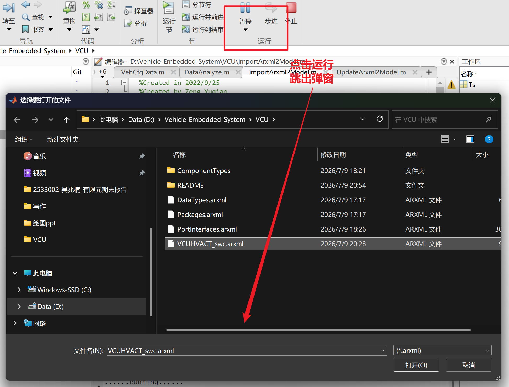

# VCU高压上下电项目

## 一、原理

### 1.1 高压组件组成

下图是电车高压系统：


- **VCU：**VCU 即车辆控制单元（Vehicle Control Unit），是电动汽车和混合动力汽车的核心控制部件，它就像是汽车的 “大脑”，对整车的运行起着关键的控制和协调作用。

- **BMS（电池管理系统）**：BMS是电动汽车电池系统的核心组件，承担着监测电池状态、管理电池充放电、保护电池安全等重要职责。它实时采集电池的电压、电流、温度等参数，精确计算电池的**剩余电量（SOC）和健康状态（SOH）。**当电池出现过充、过放、过温等异常情况时，BMS会迅速采取保护措施，防止电池损坏，确保电池的性能、寿命和安全性。
- **DCDC（直流 - 直流转换器）**：DCDC的主要功能是**将动力电池的高压直流电转换为车辆低压系统所需的低压直流电**，为车内的各种低压设备，如车载电脑、车灯、音响、传感器等提供稳定的电源。通过高效的电压转换，DCDC不仅保证了低压设备的正常运行，还提高了能源的利用效率。
- **主负继电器**：主负继电器在高压电路中起着关键的开关作用，串联于动力电池的负极回路。它的**开合状态直接控制着高压主回路的通断。**当主负继电器**闭合时，动力电池的负极与高压电路连通，为整个高压系统供电；**当主负继电器**断开时，高压主回路切断，防止高压电输出，保障系统安全。**
- **电驱（电机驱动系统）**：电驱是电动汽车的动力输出核心，主要由**电机、控制器和传动装置**等组成。其工作原理是将动力电池提供的电能转化为机械能，驱动车辆行驶。在车辆行驶过程中，**电驱根据驾驶员的操作指令，如加速、减速、停车等，精确控制电机的转速和扭矩，实现车辆的平稳运行和高效驱动。**
- **主预充接触器和主正接触器**：主预充接触器和主正接触器都位于**电机控制器的高压直流母线与整车高压母线之间**。主预充接触器的作用是在**主正接触器闭合之前，先通过其回路中的预充电阻对电机控制器的电容进行充电，使主正接触器两端的电压逐渐接近母线电压，避免主正接触器闭合时产生过大的冲击电流，保护电机控制器和其他高压设备。**当电容充电完成后，主正接触器闭合，主预充断开，承担起电机控制器的正常供电任务，而主预充接触器则断开。


>预充：
>
>燃料电池/电池高压系统中，DC/DC、逆变器、电机控制器等输入端通常都有**母线电容**。
>
>刚上电时：
>$$
>U_C(0)=0
>$$
>而动力电池或燃料电池高压端可能是几百伏，例如：
>$$
>U_{bat}=300V
>$$
>如果直接闭合主正接触器，相当于把一个**0V的大电容**直接接到**300V电源**上。
>
>电容瞬间近似短路：
>$$
>i = C\frac{du}{dt}
>$$
>此时 $du/dt$ 很大，所以会产生很大的冲击电流。
>
>结果可能是：
>
>- 主正接触器触点烧蚀、粘连；
>- 母线电容受冲击；
>- 电池瞬间大电流放电；
>- 系统报过流故障；
>- 保险丝熔断。
>
>所以不能直接合主正，要先预充。
>
>**主负接触器 K-**：先接通负极回路；
>
>**预充接触器 Kpre**：通过预充电阻给母线电容充电；
>
>**主正接触器 K+**：等母线电压接近电池电压后，再正式接通主回路。
>
>因为串联了预充电阻，所以电流被限制：
>$$
>i_{pre}(t)=\frac{U_{bat}-U_{bus}(t)}{R_{pre}}
>$$
>刚开始时：
>$$
>U_{bus}=0
>$$
>所以最大预充电流为：
>$$
>i_{pre,max}=\frac{U_{bat}}{R_{pre}}
>$$
>**随着母线电容电压升高，压差变小，预充电流逐渐减小。==小到一定阈值就可以开启主正接触器了==**
>
>母线电容电压满足一阶充电规律：
>$$
>U_{bus}(t)=U_{bat}\left(1-e^{-\frac{t}{R_{pre}C_{bus}}}\right)
>$$
>其中：
>
>- $R_{pre}$：预充电阻；
>- $C_{bus}$：高压母线电容；
>- $R_{pre}C_{bus}$：预充时间常数。
>
>一般认为经过 $3\sim5$ 个时间常数后，母线电压基本接近电池电压。
>
>电容原理：
>
>- **当电压上升（波峰来临时）**：电源电压高于电容两端的电压，就像水龙头的水压大于水桶里的水位。此时，**电容开始充电**，把电能以电场能的形式“吞”进去，吸收多余的电量。这就像水桶在接水，**抑制了电压的过快升高**。
>- **当电压下降（波峰过去，进入波谷）**：电源电压低于电容两端的电压，此时电容反而变成了“小电池”，**开始放电**，把自己储存的电能释放回电路。就像水桶在缺水时主动放水，**填补了电压的下跌**。

刚开始的时候的高压直流电来的时候是增加的，是变化的，所以电容可以用，我先把母线电压稳住后，再通往负载，此时高压直流电稳定了，电容断了。


### 1.2 上电/运行/下电逻辑

**上电逻辑：**

1. 车辆启动时，**BMS**首先进行自检，确认电池状态正常后，**向VCU（车辆控制单元）发送允许上电信号**。
2. VCU接收到信号后，**发出控制指令，闭合主负继电器，使动力电池的负极与高压电路连通。**
3. 接着，VCU控制**DCDC启动，将高压直流电转换为低压电，为车辆的低压系统供电，同时为BMS、VCU等控制单元提供工作电源。**
4. 随后，VCU发送指令**闭合主预充接触器，通过预充电阻对电机控制器的电容进行预充电。**
5. 当主正接触器两端的电压达到规定值后，VCU控制**主正接触器闭合，然后断开主预充接触器**。
6. 完成上电过程，电驱系统准备就绪，车辆可以正常行驶。

**运行逻辑：**

1. 在车辆运行过程中，**BMS持续监测电池的状态，并将相关信息发送给VCU和DCDC。**
2. DCDC**根据车辆的用电需求，动态调整输出电压和电流，为低压系统稳定供电。**
3. 主负继电器保持闭合状态，确保高压主回路的畅通；
4. 主正接触器也保持闭合，为电驱系统提供稳定的高压电源。
5. 电驱系统根据驾驶员的操作和车辆的行驶状态，实时调整电机的工作状态，实现车辆的动力输出和行驶控制。

**下电逻辑：**

1. 车辆需要下电时，**VCU发出指令**，首先**断开主正接触器**，切断电驱系统的高压电源。
2. 然后，控制**主预充接触器保持断开状态，防止电容反向放电。**
3. 接着，**DCDC停止工作**，不再为低压系统供电。
4. 最后，VCU控制**主负继电器断开**，切断动力电池与高压电路的连接，使整个高压系统断电。
5. BMS继续监测电池状态，确保电池安全，车辆进入下电状态。 


**行车就绪档功能解析**

- **低压激活阶段**：钥匙旋至行车就绪档时，12V低压系统通电，VCU、BMS、MCU等控制模块被唤醒，仪表盘亮起故障指示灯，启动自检流程；
- **系统预准备**：完成绝缘检测（>5MΩ）、高压互锁回路验证，但高压继电器未闭合，车辆处于"可启动但未上高压"状态。

**动力启动档功能逻辑**

电机控制器直流高压母线连接在整车高压母线上，配备主正接触器和主预充接触器。在接通主正接触器前，先闭合主预充接触器，利用其回路中的电阻和二极管防止反向电压冲击电机控制器，避免电压突然升高和瞬间电流过大。当主正接触器两端电压与母线电压一致时，闭合主正接触器，随后断开主预充接触器。

- **高压激活触发**：动力启动档信号触发VCU向BMS发送高压上电指令，进入预充流程；
- **状态转换标志**：仪表显示"READY"灯表示高压系统已就绪，此时车辆具备驱动能力，与传统燃油车点火成功状态等效。

## 二、软件架构

利用Davinci Developer工具实现高压系统应用层软件架构设计。

**High-voltage power-on / power-off——高压上下电**

1. 新建一个Developer文件叫做HVACT（HV代表高压上下电，ACT代表动作）

   

2. 创建一个SWC——VCUHVACT。即创建了一个Application Component Types (应用组件类型)。


3. 创建接口，需要创建的接口如下表：

   信号名定义规则：read(输入)/write(输出)_功能描述__功能类型(Status/Signal/Request)

| 信号名                                 | 信号类型 | 物理含义             | 数据变量类型                          |
| -------------------------------------- | -------- | -------------------- | ------------------------------------- |
| read_SelfCheck_Status                  | 输入信号 | 自检状态             | boolean假设状态用0、1等简单数字表示） |
| read_VehicleFaultLevel                 | 输入信号 | 整车故障等级         | uint8_t（可表示不同等级）             |
| read_BmsMainNegativeRelay_Status       | 输入信号 | 主负接触器状态       | boolean（如0断开，1闭合）             |
| read_KeyOnSwitch_Signal                | 输入信号 | 钥匙行车就绪档信号   | boolean（0未按下，1按下）             |
| read_SlowChargePlug_Status             | 输入信号 | 慢充插枪信号状态     | boolean（0未插，1已插）               |
| read_FastChargePlug_Status             | 输入信号 | 快充插枪信号状态     | boolean（0未插，1已插）               |
| read_KeyStartSwitch_Signal             | 输入信号 | 钥匙动力激活档信号   | boolean（0未按下，1按下）             |
| read_AcceleratorPedal_Opening          | 输入信号 | 加速踏板开度值       | uint16_t（开度值可能范围较广）        |
| read_BrakePedal_Status                 | 输入信号 | 制动踏板状态         | uint8_t（0未踩下，1踩下）             |
| read_ActualGear_Status                 | 输入信号 | 当前档位             | uint8_t（表示不同档位）               |
| read_VehicleSpeed_Kph                  | 输入信号 | 当前车速             | float64（更精确表示车速）             |
| read_PduMainPrechargeRelay_Status      | 输入信号 | 主预充接触器状态     | uint8_t（0断开，1闭合）               |
| read_PduMainRelay_Status               | 输入信号 | 主正接触器状态       | uint8_t（0断开，1闭合）               |
| read_McuWorking_Status                 | 输入信号 | MCU工作状态          | uint8_t（表示不同工作状态）           |
| read_KeyONSwitch_Signal                | 输入信号 | 钥匙行车就绪档信号   | uint8_t（0未按下，1按下）             |
| read_BmsBattery_SocValue               | 输入信号 | 电池SOC值            | float64（精确表示电量百分比）         |
| read_BmsRelayOff_Request               | 输入信号 | BMS下高压请求        | uint8_t（0无请求，1有请求）           |
| read_BmsMainNegativeRelayClosed_Status | 输入信号 | 主负接触器闭合状态   | uint8_t（0断开，1闭合）               |
| read_DcdcWorking_Status                | 输入信号 | DCDC工作状态         | uint8_t（表示不同工作状态）           |
| read_BmsBatteryTotal_Current           | 输入信号 | 电池总电流           | float64（精确表示电流值）             |
| write_MainPrechargeRelay_Enable        | 输出信号 | 主预充接触器控制指令 | uint8_t（0禁止，1使能）               |
| write_MainRelay_Enable                 | 输出信号 | 主正接触器控制指令   | uint8_t（0禁止，1使能）               |
| write_VehicleReady_Status              | 输出信号 | 车辆Ready状态        | uint8_t（0未就绪，1就绪）             |
| write_McuActiveDischarge_Instruction   | 输出信号 | MCU主动放电指令      | uint8_t（0禁止，1使能）               |
| write_PCANTransmission_Enable          | 输出信号 | PCAN报文发送使能     | uint8_t（0禁止，1使能）               |
| write_ECANTransmission_Enable          | 输出信号 | ECAN报文发送使能     | uint8_t（0禁止，1使能）               |
| write_VcuSleep_Status                  | 输出信号 | VCU休眠状态          | uint8_t（0唤醒，1休眠）               |
| write_MainNegativeRelay_Enable         | 输出信号 | 主负接触器控制指令   | uint8_t（0禁止，1使能）               |
| write_Dcdc_Enable                      | 输出信号 | DCDC使能             | uint8_t（0禁止，1使能）               |
| write_DcdcFault_Status                 | 输出信号 | DCDC故障状态         | uint8_t（0无故障，1有故障）           |
| write_BmsFault_Status                  | 输出信号 | BMS故障状态          | uint8_t（0无故障，1有故障）           |

上面是所有涉及到信号，下面是developer需要创建的：

| 信号名                                 | 信号类型 | 物理含义             | 数据变量类型                      |
| -------------------------------------- | -------- | -------------------- | --------------------------------- |
| read_AcceleratorPedal_Opening          | 输入信号 | 加速踏板开度值       | uint16_t（开度值，范围较广）      |
| read_ActualGear_Status                 | 输入信号 | 当前挡位             | uint8_t（表示不同挡位）           |
| read_BmsBattery_SocValue               | 输入信号 | 电池SOC值            | float / float64（表示电量百分比） |
| read_BmsBatteryTotal_Current           | 输入信号 | 电池总电流           | float / float64（表示电流值）     |
| read_BmsMainNegativeRelay_Status       | 输入信号 | 主负接触器状态       | boolean（0断开，1闭合）           |
| read_BmsMainNegativeRelayClosed_Status | 输入信号 | 主负接触器闭合状态   | uint8_t（0断开，1闭合）           |
| read_BmsRelayOff_Request               | 输入信号 | BMS下高压请求        | uint8_t（0无请求，1有请求）       |
| read_BrakePedal_Status                 | 输入信号 | 制动踏板状态         | uint8_t（0未踩下，1踩下）         |
| read_DcdcWorking_Status                | 输入信号 | DCDC工作状态         | uint8_t（表示不同工作状态）       |
| read_FastChargePlug_Status             | 输入信号 | 快充插枪信号状态     | boolean（0未插，1已插）           |
| read_KeyOnSwitch_Signal                | 输入信号 | 钥匙行车就绪档信号   | boolean（0未按下，1按下）         |
| read_KeyStartSwitch_Signal             | 输入信号 | 钥匙动力激活档信号   | boolean（0未按下，1按下）         |
| read_McuWorking_Status                 | 输入信号 | MCU工作状态          | uint8_t（表示不同工作状态）       |
| read_PduMainPrechargeRelay_Status      | 输入信号 | 主预充接触器状态     | uint8_t（0断开，1闭合）           |
| read_PduMainRelay_Status               | 输入信号 | 主正接触器状态       | uint8_t（0断开，1闭合）           |
| read_SelfCheck_Status                  | 输入信号 | 自检状态             | boolean（0未通过，1通过）         |
| read_SlowChargePlug_Status             | 输入信号 | 慢充插枪信号状态     | boolean（0未插，1已插）           |
| read_VehicleFaultLevel                 | 输入信号 | 整车故障等级         | uint8_t（表示不同故障等级）       |
| read_VehicleSpeed_Kph                  | 输入信号 | 当前车速             | float / float64（表示车速值）     |
| write_BmsFault_Status                  | 输出信号 | BMS故障状态          | uint8_t（0无故障，1有故障）       |
| write_DcdcFault_Status                 | 输出信号 | DCDC故障状态         | uint8_t（0无故障，1有故障）       |
| write_Dcdc_Enable                      | 输出信号 | DCDC使能指令         | uint8_t（0禁止，1使能）           |
| write_MainNegativeRelay_Enable         | 输出信号 | 主负接触器控制指令   | uint8_t（0禁止，1使能）           |
| write_MainPrechargeRelay_Enable        | 输出信号 | 主预充接触器控制指令 | uint8_t（0禁止，1使能）           |
| write_MainRelay_Enable                 | 输出信号 | 主正接触器控制指令   | uint8_t（0禁止，1使能）           |
| write_VehicleReady_Status              | 输出信号 | 车辆Ready状态        | uint8_t（0未就绪，1就绪）         |

没用到的信号：


使用的是S/R接口：

| 特性         | S/R 接口 (发送者-接收者)                                     | C/S 接口 (客户端-服务器)                                     |
| :----------- | :----------------------------------------------------------- | :----------------------------------------------------------- |
| **通信目的** | **数据交换** (Data Exchange)                                 | **服务/操作调用** (Service/Operation Call)                   |
| **通信模式** | 1 对 N 的广播 (数据分发)                                     | N 对 1 的请求/应答                                           |
| **实现机制** | **全局变量** (Global Variable)                               | **函数调用** (Function Call)                                 |
| **典型API**  | `Rte_Write_<X>()`, `Rte_Read_<X>()`                          | `Rte_Call_<Operation>()`                                     |
| **端口角色** | **发送者(Sender)** 提供数据 (PPort) **接收者(Receiver)** 需求数据 (RPort) | **服务器(Server)** 提供服务 (PPort) **客户端(Client)** 请求服务 (RPort) |


4. 给SWC添加接口。

   


​	同理添加输入信号。

5. 设置接口初始值。


6. 创建runnable。设置成100ms周期触发，然后我们的输入选择所有，输出选择所有。

   

**Minimum Start Interval：允许某个部件（如空调压缩机、PTC加热器、水泵或电机）两次连续启动命令之间必须满足的最短时间间隔。**


7. 选中SWC，做一次Check。

   

8. 导出arxml文件。

   


## 三、基于ARXML自动生成simulink模型

AUTOSAR（Automotive Open System Architecture）作为汽车电子领域主流开发标准，采用ARXML（AUTOSAR XML）格式进行系统描述。ARXML文件包含：

- 软件组件（SWC）接口定义
- 数据类型（DataType）规范
- 端口（Port）通信配置
- 运行实体（Runnable）时序约束

### 3.1 基于ARXML的Simulink模型自动生成技术

导入脚本：

模型和 ARXML 必须在当前 MATLAB 工作路径下。

```matlab
% Created in 2022/9/25
% Created by Zeng Yuqiao

% 在命令行窗口显示程序开始运行的提示信息
disp('......Running......')

% 获取当前 MATLAB 工作区中的所有变量名
% who 返回的是一个 cell 数组，每个元素是一个变量名字符串
% 例如：Cache = {'a'; 'b'; 'modelName'}
Cache = who;

% 遍历当前工作区中的所有变量
% 目的是在导入 ARXML 前，清空当前工作区中已有的变量，
% 避免旧变量对后续 AUTOSAR 模型导入过程产生影响
for i = 1:length(Cache)

    % 清除工作区中名称为 Cache{i} 的变量
    % Cache{i} 表示第 i 个变量名
    % eval 用于执行字符串形式的 MATLAB 命令
    %
    % 例如：
    % 如果 Cache{i} = 'a'
    % 那么这里相当于执行 clear('a')
    eval('clear(Cache{i})');

end

% 弹出文件选择窗口，让用户选择一个 ARXML 文件
% '*.arxml' 表示只显示后缀名为 .arxml 的文件
%
% ArxmlFile 保存用户选择的文件名
% 第二个输出参数是文件路径，这里用 ~ 忽略了
[ArxmlFile, ~] = uigetfile('*.arxml');

% 判断用户是否成功选择了 ARXML 文件
% 如果用户点击取消，则 ArxmlFile 的值为 0
% 如果 ArxmlFile 不等于 0，说明用户选择了文件，继续执行导入操作
if ~isequal(ArxmlFile, 0)

    % 创建 ARXML 导入器对象
    % arxml.importer 用于读取和解析 AUTOSAR ARXML 文件
    % ar 是后续创建 Simulink 模型和组件时使用的导入对象
    ar = arxml.importer(ArxmlFile);

    % 从 ARXML 文件中获取所有 AUTOSAR 组件的名称
    % getComponentNames 返回一个 cell 数组
    % 每个元素对应 ARXML 文件中的一个 AUTOSAR Component
    %
    % 这里重新创建了一次 arxml.importer(ArxmlFile)
    % 功能上可以运行，但也可以直接写成：
    % names = getComponentNames(ar);
    names = getComponentNames(arxml.importer(ArxmlFile));

    % 遍历 ARXML 文件中的所有 AUTOSAR 组件
    % 对每一个组件，都创建一个对应的 Simulink 模型
    for i = 1:length(names)

        % 根据 ARXML 中的第 i 个 AUTOSAR 组件创建 Simulink 模型
        %
        % ar：
        %   前面创建的 ARXML 导入对象
        %
        % names{i}：
        %   当前要导入的 AUTOSAR 组件名称
        %
        % 'ModelPeriodicRunnablesAs','FunctionCallSubsystem'：
        %   指定周期性 runnable 的建模方式
        %   这里表示将 AUTOSAR 中的周期性 Runnable
        %   建模为 Simulink 中的 Function-Call Subsystem
        %
        % Function-Call Subsystem 常用于表示由调度器触发执行的功能模块
        createComponentAsModel(ar, names{i}, ...
            'ModelPeriodicRunnablesAs', 'FunctionCallSubsystem');

        % 保存当前打开的 Simulink 模型
        % createComponentAsModel 创建模型后，当前模型会成为活动模型
        % save_system 不带参数时，默认保存当前系统
        save_system;

        % 获取当前 Simulink 模型的根模型名称
        % bdroot 表示当前模块所属的顶层模型
        % get_param(bdroot,'Name') 返回模型名称，不包含 .slx 后缀
        %
        % 这一行只获取模型名，但没有赋值给变量
        % 因此结果会默认存放在 ans 中
        get_param(bdroot, 'Name');

        % 清除部分临时变量
        %
        % i：
        %   循环计数变量
        %
        % Cache：
        %   前面保存工作区变量名的 cell 数组
        %
        % ar：
        %   ARXML 导入器对象
        %
        % names：
        %   AUTOSAR 组件名称列表
        %
        % ans：
        %   MATLAB 默认临时变量
        %
        % ArxmlFile：
        %   用户选择的 ARXML 文件名
        %
        % 注意：
        % 这里在 for 循环内部清除 i、ar、names 等变量，
        % 可能会影响循环继续执行。
        % 如果 ARXML 文件中只有一个组件，一般问题不明显；
        % 如果有多个组件，这种写法可能导致后续循环异常。
        clear i Cache ar names ans ArxmlFile;

        % 在 base 工作区中执行命令：
        % 将当前工作区变量保存成一个 MATLAB 脚本文件
        %
        % matlab.io.saveVariablesToScript(...) 的作用是：
        % 将 base 工作区中的变量保存为 .m 脚本，
        % 以后运行该脚本可以重新生成这些变量
        %
        % strcat(get_param(bdroot,'Name'),'_data.m') 的作用是：
        % 生成数据脚本文件名
        %
        % 例如：
        % 如果当前模型名为 MyModel
        % 那么生成的脚本文件名为：
        % MyModel_data.m
        %
        % evalin('base', "...") 表示在 base 工作区中执行字符串命令
        evalin('base', ...
            "matlab.io.saveVariablesToScript(strcat(get_param(bdroot,'Name'),'_data.m'))");

    end
end

% 在命令行窗口显示 ARXML 导入完成的提示信息
disp('......Import Arxml Done......')
```

1. **ARXML版本兼容性**：
   1. 确保 `'AutosarVersion'` 参数与ARXML文件实际版本一致，否则可能解析失败。
2. **数据字典管理**：
   1. 若需复用数据字典，可调用 `Simulink.data.dictionary.open()` 打开现有文件。
3. **错误处理**：
   1. 建议在脚本中添加 `try-catch` 块，捕获解析或生成过程中的异常（如ARXML格式错误）。




更新arxml版本：

```matlab
% 显示提示信息，表明程序正在运行
disp('.....Running.......')

% 使用 uigetfile 函数弹出文件选择对话框，让用户选择一个 Simulink 模型文件
% *.slx 和 *.mdl 是 Simulink 模型文件的扩展名
% ModelFile 变量存储用户选择的文件的完整路径和文件名
% 第二个输出参数 ~ 表示忽略该输出，这里不需要该输出
[ModelFile,~] = uigetfile('*.slx;*.mdl');

% 再次使用 uigetfile 函数弹出文件选择对话框，让用户选择一个 ARXML 文件
% ARXML 是 AUTOSAR（Automotive Open System Architecture）相关的 XML 文件格式
% ArxmlFile 变量存储用户选择的 ARXML 文件的完整路径和文件名
% 同样，第二个输出参数 ~ 表示忽略该输出
[ArxmlFile,~] = uigetfile('*.arxml');

% 检查用户是否成功选择了 Simulink 模型文件和 ARXML 文件
% isequal(ModelFile,0) 用于判断用户是否取消了模型文件的选择
% isequal(ArxmlFile,0) 用于判断用户是否取消了 ARXML 文件的选择
% 只有当两个文件都被成功选择时，才执行后续的操作
if ~isequal(ModelFile,0)&&~isequal(ArxmlFile,0)
    % 打开用户选择的 Simulink 模型文件
    open_system(ModelFile)
    
    % 创建一个 arxml.importer 对象，用于导入 ARXML 文件中的数据
    % ar 是该对象的实例，通过传入 ARXML 文件的路径进行初始化
    ar = arxml.importer(ArxmlFile);
    
    % 调用 updateModel 函数，将 ARXML 文件中的数据更新到打开的 Simulink 模型中
    % ar 是 arxml.importer 对象，ModelFile 是 Simulink 模型文件的路径
    updateModel(ar,ModelFile)
end

% 显示提示信息，表明 ARXML 文件更新到模型的操作已完成
disp('.......Update Arxml Done......')
```

**选择一个已有的 Simulink 模型，再选择一个 ARXML 文件，然后用 ARXML 更新这个模型的 AUTOSAR 接口/配置。**

也就是说，它不是从 ARXML 新建模型，而是： **已有模型 + 新 ARXML → 更新模型接口。**

