# VCU高压上下电项目

## 一、原理

### 1.1 高压组件组成

下图是电车高压系统：

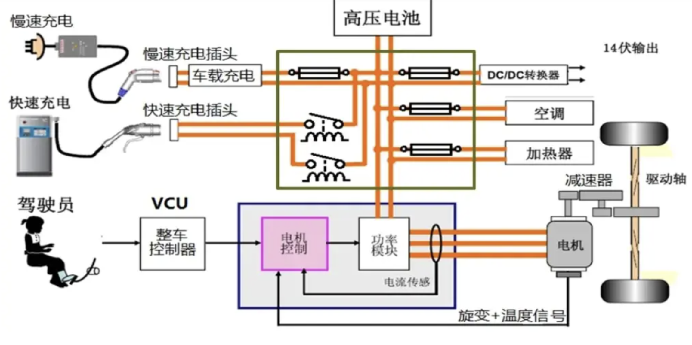

- **VCU：**VCU 即车辆控制单元（Vehicle Control Unit），是电动汽车和混合动力汽车的核心控制部件，它就像是汽车的 “大脑”，对整车的运行起着关键的控制和协调作用。

- **BMS（电池管理系统）**：BMS是电动汽车电池系统的核心组件，承担着监测电池状态、管理电池充放电、保护电池安全等重要职责。它实时采集电池的电压、电流、温度等参数，精确计算电池的**剩余电量（SOC）和健康状态（SOH）。**当电池出现过充、过放、过温等异常情况时，BMS会迅速采取保护措施，防止电池损坏，确保电池的性能、寿命和安全性。
- **DCDC（直流 - 直流转换器）**：DCDC的主要功能是**将动力电池的高压直流电转换为车辆低压系统所需的低压直流电**，为车内的各种低压设备，如车载电脑、车灯、音响、传感器等提供稳定的电源。通过高效的电压转换，DCDC不仅保证了低压设备的正常运行，还提高了能源的利用效率。
- **主负继电器**：主负继电器在高压电路中起着关键的开关作用，串联于动力电池的负极回路。它的**开合状态直接控制着高压主回路的通断。**当主负继电器**闭合时，动力电池的负极与高压电路连通，为整个高压系统供电；**当主负继电器**断开时，高压主回路切断，防止高压电输出，保障系统安全。**
- **电驱（电机驱动系统）**：电驱是电动汽车的动力输出核心，主要由**电机、控制器和传动装置**等组成。其工作原理是将动力电池提供的电能转化为机械能，驱动车辆行驶。在车辆行驶过程中，**电驱根据驾驶员的操作指令，如加速、减速、停车等，精确控制电机的转速和扭矩，实现车辆的平稳运行和高效驱动。**
- **主预充接触器和主正接触器**：主预充接触器和主正接触器都位于**电机控制器的高压直流母线与整车高压母线之间**。主预充接触器的作用是在**主正接触器闭合之前，先通过其回路中的预充电阻对电机控制器的电容进行充电，使主正接触器两端的电压逐渐接近母线电压，避免主正接触器闭合时产生过大的冲击电流，保护电机控制器和其他高压设备。**当电容充电完成后，主正接触器闭合，主预充断开，承担起电机控制器的正常供电任务，而主预充接触器则断开。

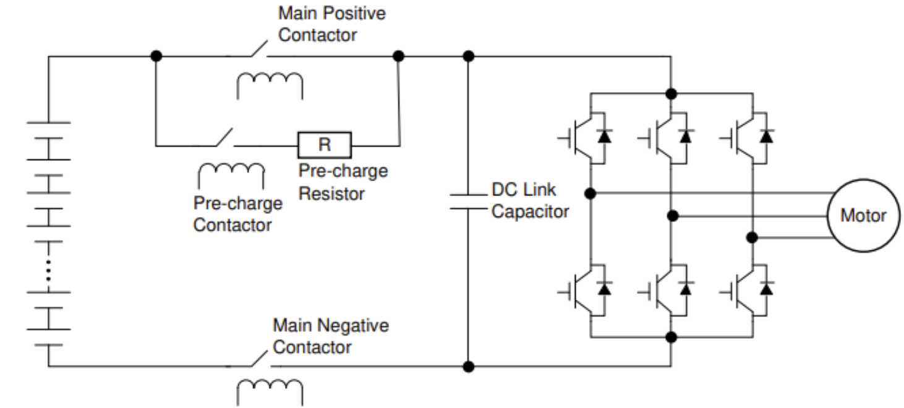

>预充：
>
>燃料电池/电池高压系统中，DC/DC、逆变器、电机控制器等输入端通常都有**母线电容**。
>
>刚上电时：
>$$
>U_C(0)=0
>$$
>而动力电池或燃料电池高压端可能是几百伏，例如：
>$$
>U_{bat}=300V
>$$
>如果直接闭合主正接触器，相当于把一个**0V的大电容**直接接到**300V电源**上。
>
>电容瞬间近似短路：
>$$
>i = C\frac{du}{dt}
>$$
>此时 $du/dt$ 很大，所以会产生很大的冲击电流。
>
>结果可能是：
>
>- 主正接触器触点烧蚀、粘连；
>- 母线电容受冲击；
>- 电池瞬间大电流放电；
>- 系统报过流故障；
>- 保险丝熔断。
>
>所以不能直接合主正，要先预充。
>
>**主负接触器 K-**：先接通负极回路；
>
>**预充接触器 Kpre**：通过预充电阻给母线电容充电；
>
>**主正接触器 K+**：等母线电压接近电池电压后，再正式接通主回路。
>
>因为串联了预充电阻，所以电流被限制：
>$$
>i_{pre}(t)=\frac{U_{bat}-U_{bus}(t)}{R_{pre}}
>$$
>刚开始时：
>$$
>U_{bus}=0
>$$
>所以最大预充电流为：
>$$
>i_{pre,max}=\frac{U_{bat}}{R_{pre}}
>$$
>**随着母线电容电压升高，压差变小，预充电流逐渐减小。==小到一定阈值就可以开启主正接触器了==**
>
>母线电容电压满足一阶充电规律：
>$$
>U_{bus}(t)=U_{bat}\left(1-e^{-\frac{t}{R_{pre}C_{bus}}}\right)
>$$
>其中：
>
>- $R_{pre}$：预充电阻；
>- $C_{bus}$：高压母线电容；
>- $R_{pre}C_{bus}$：预充时间常数。
>
>一般认为经过 $3\sim5$ 个时间常数后，母线电压基本接近电池电压。
>
>电容原理：
>
>- **当电压上升（波峰来临时）**：电源电压高于电容两端的电压，就像水龙头的水压大于水桶里的水位。此时，**电容开始充电**，把电能以电场能的形式“吞”进去，吸收多余的电量。这就像水桶在接水，**抑制了电压的过快升高**。
>- **当电压下降（波峰过去，进入波谷）**：电源电压低于电容两端的电压，此时电容反而变成了“小电池”，**开始放电**，把自己储存的电能释放回电路。就像水桶在缺水时主动放水，**填补了电压的下跌**。

刚开始的时候的高压直流电来的时候是增加的，是变化的，所以电容可以用，我先把母线电压稳住后，再通往负载，此时高压直流电稳定了，电容断了。

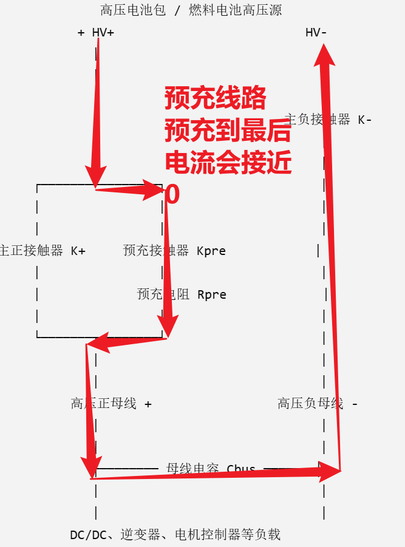

### 1.2 上电/运行/下电逻辑

**上电逻辑：**

1. 车辆启动时，**BMS**首先进行自检，确认电池状态正常后，**向VCU（车辆控制单元）发送允许上电信号**。
2. VCU接收到信号后，**发出控制指令，闭合主负继电器，使动力电池的负极与高压电路连通。**
3. 接着，VCU控制**DCDC启动，将高压直流电转换为低压电，为车辆的低压系统供电，同时为BMS、VCU等控制单元提供工作电源。**
4. 随后，VCU发送指令**闭合主预充接触器，通过预充电阻对电机控制器的电容进行预充电。**
5. 当主正接触器两端的电压达到规定值后，VCU控制**主正接触器闭合，然后断开主预充接触器**。
6. 完成上电过程，电驱系统准备就绪，车辆可以正常行驶。

**运行逻辑：**

1. 在车辆运行过程中，**BMS持续监测电池的状态，并将相关信息发送给VCU和DCDC。**
2. DCDC**根据车辆的用电需求，动态调整输出电压和电流，为低压系统稳定供电。**
3. 主负继电器保持闭合状态，确保高压主回路的畅通；
4. 主正接触器也保持闭合，为电驱系统提供稳定的高压电源。
5. 电驱系统根据驾驶员的操作和车辆的行驶状态，实时调整电机的工作状态，实现车辆的动力输出和行驶控制。

**下电逻辑：**

1. 车辆需要下电时，**VCU发出指令**，首先**断开主正接触器**，切断电驱系统的高压电源。
2. 然后，控制**主预充接触器保持断开状态，防止电容反向放电。**
3. 接着，**DCDC停止工作**，不再为低压系统供电。
4. 最后，VCU控制**主负继电器断开**，切断动力电池与高压电路的连接，使整个高压系统断电。
5. BMS继续监测电池状态，确保电池安全，车辆进入下电状态。 


**行车就绪档功能解析**

- **低压激活阶段**：钥匙旋至行车就绪档时，12V低压系统通电，VCU、BMS、MCU等控制模块被唤醒，仪表盘亮起故障指示灯，启动自检流程；
- **系统预准备**：完成绝缘检测（>5MΩ）、高压互锁回路验证，但高压继电器未闭合，车辆处于"可启动但未上高压"状态。

**动力启动档功能逻辑**

电机控制器直流高压母线连接在整车高压母线上，配备主正接触器和主预充接触器。在接通主正接触器前，先闭合主预充接触器，利用其回路中的电阻和二极管防止反向电压冲击电机控制器，避免电压突然升高和瞬间电流过大。当主正接触器两端电压与母线电压一致时，闭合主正接触器，随后断开主预充接触器。

- **高压激活触发**：动力启动档信号触发VCU向BMS发送高压上电指令，进入预充流程；
- **状态转换标志**：仪表显示"READY"灯表示高压系统已就绪，此时车辆具备驱动能力，与传统燃油车点火成功状态等效。

## 二、软件架构

利用Davinci Developer工具实现高压系统应用层软件架构设计。

**High-voltage power-on / power-off——高压上下电**

1. 新建一个Developer文件叫做HVACT（HV代表高压上下电，ACT代表动作）

   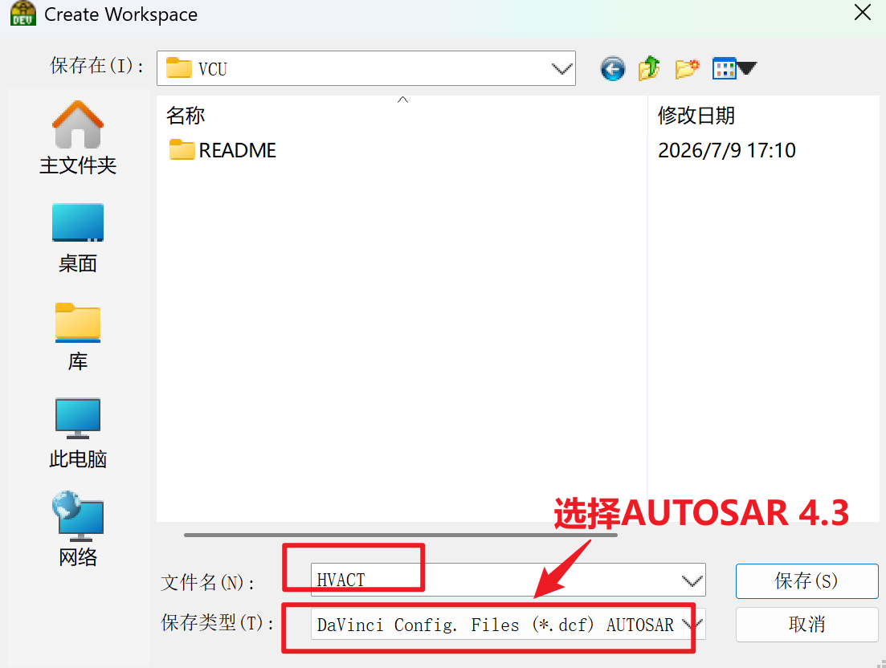

2. 创建一个SWC——VCUHVACT。即创建了一个Application Component Types (应用组件类型)。

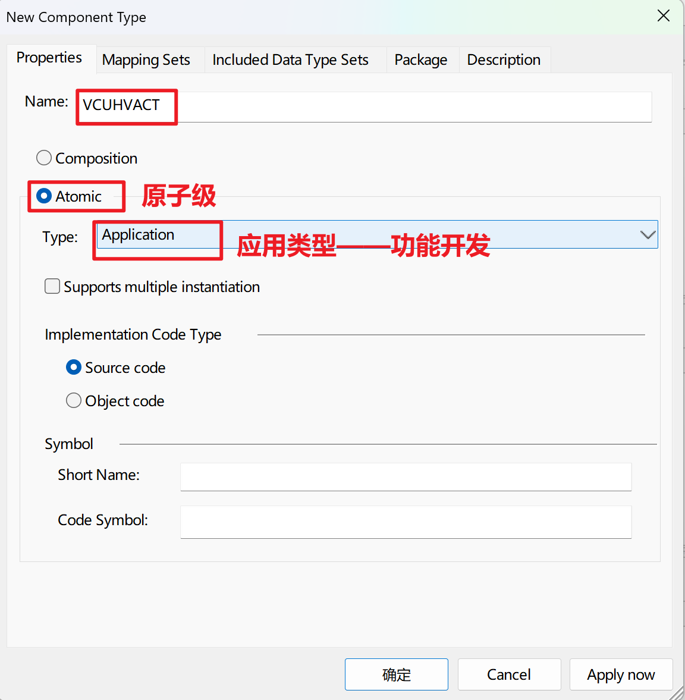

3. 创建接口，需要创建的接口如下表：

   信号名定义规则：read(输入)/write(输出)_功能描述__功能类型(Status/Signal/Request)

| 信号名                                 | 信号类型 | 物理含义             | 数据变量类型                          |
| -------------------------------------- | -------- | -------------------- | ------------------------------------- |
| read_SelfCheck_Status                  | 输入信号 | 自检状态             | boolean假设状态用0、1等简单数字表示） |
| read_VehicleFaultLevel                 | 输入信号 | 整车故障等级         | uint8_t（可表示不同等级）             |
| read_BmsMainNegativeRelay_Status       | 输入信号 | 主负接触器状态       | boolean（如0断开，1闭合）             |
| read_KeyOnSwitch_Signal                | 输入信号 | 钥匙行车就绪档信号   | boolean（0未按下，1按下）             |
| read_SlowChargePlug_Status             | 输入信号 | 慢充插枪信号状态     | boolean（0未插，1已插）               |
| read_FastChargePlug_Status             | 输入信号 | 快充插枪信号状态     | boolean（0未插，1已插）               |
| read_KeyStartSwitch_Signal             | 输入信号 | 钥匙动力激活档信号   | boolean（0未按下，1按下）             |
| read_AcceleratorPedal_Opening          | 输入信号 | 加速踏板开度值       | uint16_t（开度值可能范围较广）        |
| read_BrakePedal_Status                 | 输入信号 | 制动踏板状态         | uint8_t（0未踩下，1踩下）             |
| read_ActualGear_Status                 | 输入信号 | 当前档位             | uint8_t（表示不同档位）               |
| read_VehicleSpeed_Kph                  | 输入信号 | 当前车速             | float64（更精确表示车速）             |
| read_PduMainPrechargeRelay_Status      | 输入信号 | 主预充接触器状态     | uint8_t（0断开，1闭合）               |
| read_PduMainRelay_Status               | 输入信号 | 主正接触器状态       | uint8_t（0断开，1闭合）               |
| read_McuWorking_Status                 | 输入信号 | MCU工作状态          | uint8_t（表示不同工作状态）           |
| read_KeyONSwitch_Signal                | 输入信号 | 钥匙行车就绪档信号   | uint8_t（0未按下，1按下）             |
| read_BmsBattery_SocValue               | 输入信号 | 电池SOC值            | float64（精确表示电量百分比）         |
| read_BmsRelayOff_Request               | 输入信号 | BMS下高压请求        | uint8_t（0无请求，1有请求）           |
| read_BmsMainNegativeRelayClosed_Status | 输入信号 | 主负接触器闭合状态   | uint8_t（0断开，1闭合）               |
| read_DcdcWorking_Status                | 输入信号 | DCDC工作状态         | uint8_t（表示不同工作状态）           |
| read_BmsBatteryTotal_Current           | 输入信号 | 电池总电流           | float64（精确表示电流值）             |
| write_MainPrechargeRelay_Enable        | 输出信号 | 主预充接触器控制指令 | uint8_t（0禁止，1使能）               |
| write_MainRelay_Enable                 | 输出信号 | 主正接触器控制指令   | uint8_t（0禁止，1使能）               |
| write_VehicleReady_Status              | 输出信号 | 车辆Ready状态        | uint8_t（0未就绪，1就绪）             |
| write_McuActiveDischarge_Instruction   | 输出信号 | MCU主动放电指令      | uint8_t（0禁止，1使能）               |
| write_PCANTransmission_Enable          | 输出信号 | PCAN报文发送使能     | uint8_t（0禁止，1使能）               |
| write_ECANTransmission_Enable          | 输出信号 | ECAN报文发送使能     | uint8_t（0禁止，1使能）               |
| write_VcuSleep_Status                  | 输出信号 | VCU休眠状态          | uint8_t（0唤醒，1休眠）               |
| write_MainNegativeRelay_Enable         | 输出信号 | 主负接触器控制指令   | uint8_t（0禁止，1使能）               |
| write_Dcdc_Enable                      | 输出信号 | DCDC使能             | uint8_t（0禁止，1使能）               |
| write_DcdcFault_Status                 | 输出信号 | DCDC故障状态         | uint8_t（0无故障，1有故障）           |
| write_BmsFault_Status                  | 输出信号 | BMS故障状态          | uint8_t（0无故障，1有故障）           |

上面是所有涉及到信号，下面是developer需要创建的：

| 信号名                                 | 信号类型 | 物理含义             | 数据变量类型                      |
| -------------------------------------- | -------- | -------------------- | --------------------------------- |
| read_AcceleratorPedal_Opening          | 输入信号 | 加速踏板开度值       | uint16_t（开度值，范围较广）      |
| read_ActualGear_Status                 | 输入信号 | 当前挡位             | uint8_t（表示不同挡位）           |
| read_BmsBattery_SocValue               | 输入信号 | 电池SOC值            | float / float64（表示电量百分比） |
| read_BmsBatteryTotal_Current           | 输入信号 | 电池总电流           | float / float64（表示电流值）     |
| read_BmsMainNegativeRelay_Status       | 输入信号 | 主负接触器状态       | boolean（0断开，1闭合）           |
| read_BmsMainNegativeRelayClosed_Status | 输入信号 | 主负接触器闭合状态   | uint8_t（0断开，1闭合）           |
| read_BmsRelayOff_Request               | 输入信号 | BMS下高压请求        | uint8_t（0无请求，1有请求）       |
| read_BrakePedal_Status                 | 输入信号 | 制动踏板状态         | uint8_t（0未踩下，1踩下）         |
| read_DcdcWorking_Status                | 输入信号 | DCDC工作状态         | uint8_t（表示不同工作状态）       |
| read_FastChargePlug_Status             | 输入信号 | 快充插枪信号状态     | boolean（0未插，1已插）           |
| read_KeyOnSwitch_Signal                | 输入信号 | 钥匙行车就绪档信号   | boolean（0未按下，1按下）         |
| read_KeyStartSwitch_Signal             | 输入信号 | 钥匙动力激活档信号   | boolean（0未按下，1按下）         |
| read_McuWorking_Status                 | 输入信号 | MCU工作状态          | uint8_t（表示不同工作状态）       |
| read_PduMainPrechargeRelay_Status      | 输入信号 | 主预充接触器状态     | uint8_t（0断开，1闭合）           |
| read_PduMainRelay_Status               | 输入信号 | 主正接触器状态       | uint8_t（0断开，1闭合）           |
| read_SelfCheck_Status                  | 输入信号 | 自检状态             | boolean（0未通过，1通过）         |
| read_SlowChargePlug_Status             | 输入信号 | 慢充插枪信号状态     | boolean（0未插，1已插）           |
| read_VehicleFaultLevel                 | 输入信号 | 整车故障等级         | uint8_t（表示不同故障等级）       |
| read_VehicleSpeed_Kph                  | 输入信号 | 当前车速             | float / float64（表示车速值）     |
| write_BmsFault_Status                  | 输出信号 | BMS故障状态          | uint8_t（0无故障，1有故障）       |
| write_DcdcFault_Status                 | 输出信号 | DCDC故障状态         | uint8_t（0无故障，1有故障）       |
| write_Dcdc_Enable                      | 输出信号 | DCDC使能指令         | uint8_t（0禁止，1使能）           |
| write_MainNegativeRelay_Enable         | 输出信号 | 主负接触器控制指令   | uint8_t（0禁止，1使能）           |
| write_MainPrechargeRelay_Enable        | 输出信号 | 主预充接触器控制指令 | uint8_t（0禁止，1使能）           |
| write_MainRelay_Enable                 | 输出信号 | 主正接触器控制指令   | uint8_t（0禁止，1使能）           |
| write_VehicleReady_Status              | 输出信号 | 车辆Ready状态        | uint8_t（0未就绪，1就绪）         |

没用到的信号：

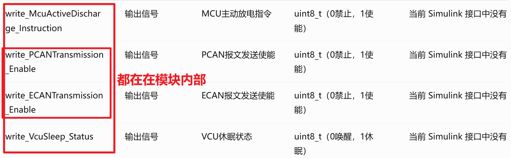

使用的是S/R接口：

| 特性         | S/R 接口 (发送者-接收者)                                     | C/S 接口 (客户端-服务器)                                     |
| :----------- | :----------------------------------------------------------- | :----------------------------------------------------------- |
| **通信目的** | **数据交换** (Data Exchange)                                 | **服务/操作调用** (Service/Operation Call)                   |
| **通信模式** | 1 对 N 的广播 (数据分发)                                     | N 对 1 的请求/应答                                           |
| **实现机制** | **全局变量** (Global Variable)                               | **函数调用** (Function Call)                                 |
| **典型API**  | `Rte_Write_<X>()`, `Rte_Read_<X>()`                          | `Rte_Call_<Operation>()`                                     |
| **端口角色** | **发送者(Sender)** 提供数据 (PPort) **接收者(Receiver)** 需求数据 (RPort) | **服务器(Server)** 提供服务 (PPort) **客户端(Client)** 请求服务 (RPort) |

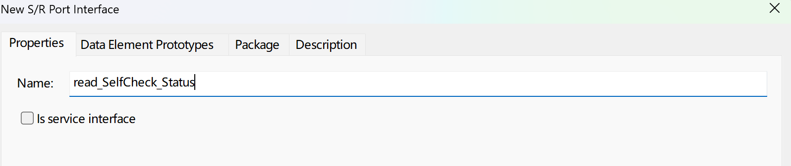

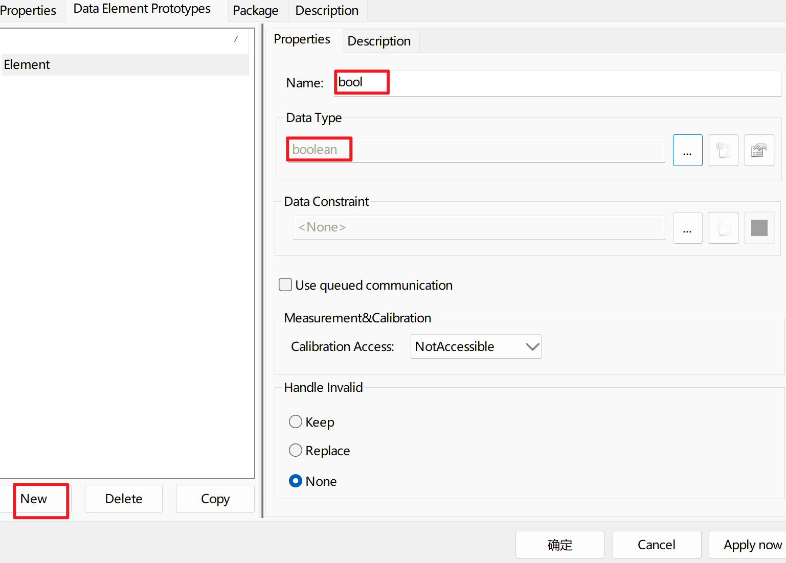

4. 给SWC添加接口。

   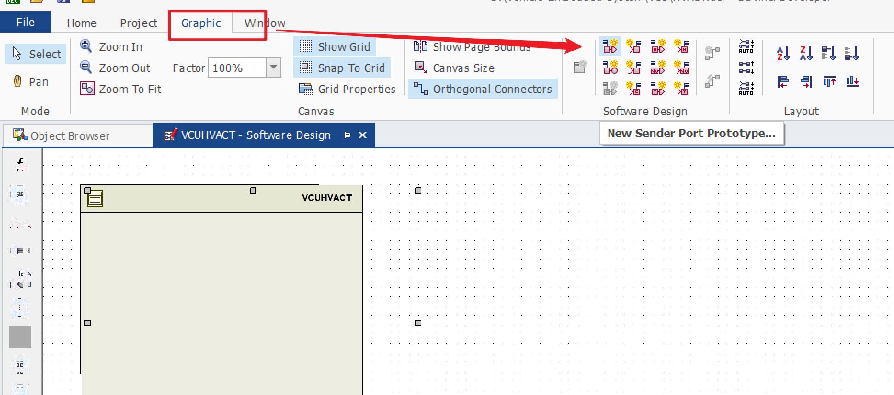

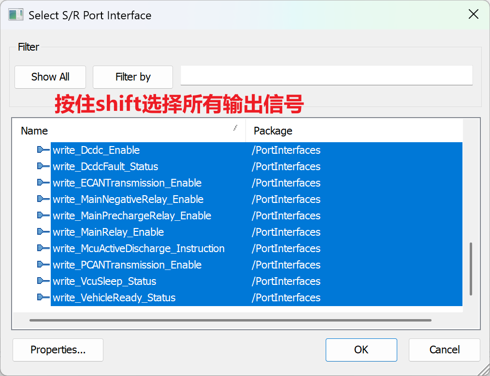

​	同理添加输入信号。

5. 设置接口初始值。

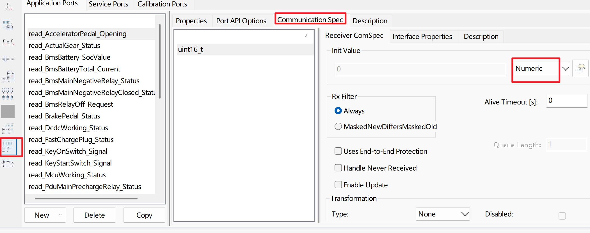

6. 创建runnable。设置成100ms周期触发，然后我们的输入选择所有，输出选择所有。

   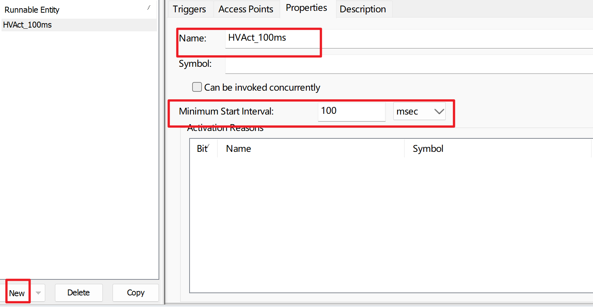

**Minimum Start Interval：允许某个部件（如空调压缩机、PTC加热器、水泵或电机）两次连续启动命令之间必须满足的最短时间间隔。**

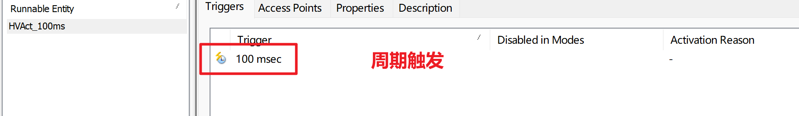

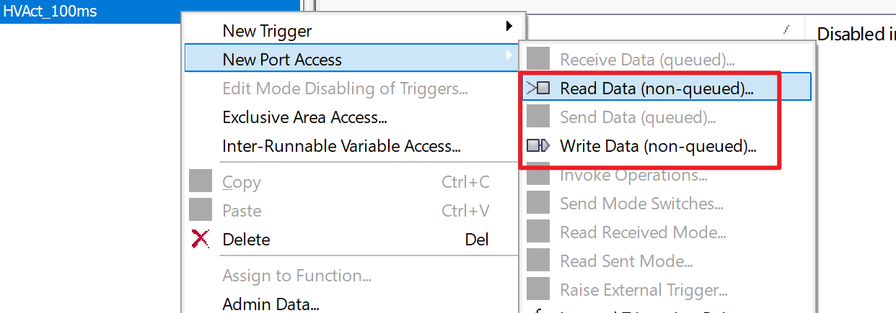

7. 选中SWC，做一次Check。

   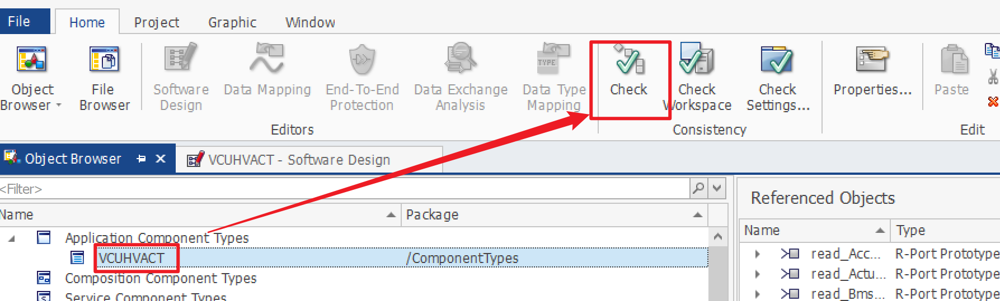

8. 导出arxml文件。

   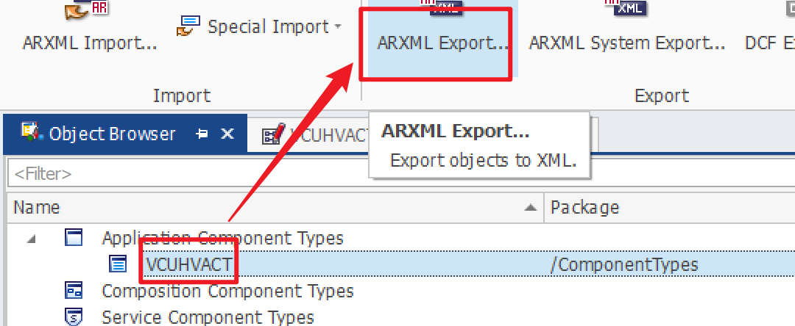

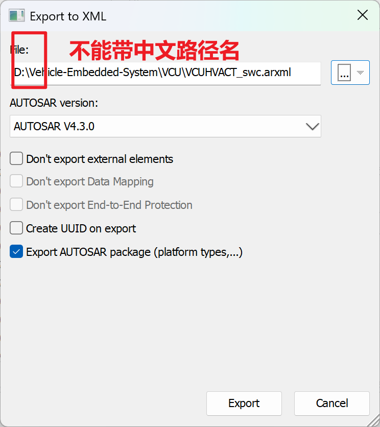

## 三、基于ARXML自动生成simulink模型

AUTOSAR（Automotive Open System Architecture）作为汽车电子领域主流开发标准，采用ARXML（AUTOSAR XML）格式进行系统描述。ARXML文件包含：

- 软件组件（SWC）接口定义
- 数据类型（DataType）规范
- 端口（Port）通信配置
- 运行实体（Runnable）时序约束

### 3.1 基于ARXML的Simulink模型自动生成技术

导入脚本：

模型和 ARXML 必须在当前 MATLAB 工作路径下。

```matlab
% Created in 2022/9/25
% Created by Zeng Yuqiao

% 在命令行窗口显示程序开始运行的提示信息
disp('......Running......')

% 获取当前 MATLAB 工作区中的所有变量名
% who 返回的是一个 cell 数组，每个元素是一个变量名字符串
% 例如：Cache = {'a'; 'b'; 'modelName'}
Cache = who;

% 遍历当前工作区中的所有变量
% 目的是在导入 ARXML 前，清空当前工作区中已有的变量，
% 避免旧变量对后续 AUTOSAR 模型导入过程产生影响
for i = 1:length(Cache)

    % 清除工作区中名称为 Cache{i} 的变量
    % Cache{i} 表示第 i 个变量名
    % eval 用于执行字符串形式的 MATLAB 命令
    %
    % 例如：
    % 如果 Cache{i} = 'a'
    % 那么这里相当于执行 clear('a')
    eval('clear(Cache{i})');

end

% 弹出文件选择窗口，让用户选择一个 ARXML 文件
% '*.arxml' 表示只显示后缀名为 .arxml 的文件
%
% ArxmlFile 保存用户选择的文件名
% 第二个输出参数是文件路径，这里用 ~ 忽略了
[ArxmlFile, ~] = uigetfile('*.arxml');

% 判断用户是否成功选择了 ARXML 文件
% 如果用户点击取消，则 ArxmlFile 的值为 0
% 如果 ArxmlFile 不等于 0，说明用户选择了文件，继续执行导入操作
if ~isequal(ArxmlFile, 0)

    % 创建 ARXML 导入器对象
    % arxml.importer 用于读取和解析 AUTOSAR ARXML 文件
    % ar 是后续创建 Simulink 模型和组件时使用的导入对象
    ar = arxml.importer(ArxmlFile);

    % 从 ARXML 文件中获取所有 AUTOSAR 组件的名称
    % getComponentNames 返回一个 cell 数组
    % 每个元素对应 ARXML 文件中的一个 AUTOSAR Component
    %
    % 这里重新创建了一次 arxml.importer(ArxmlFile)
    % 功能上可以运行，但也可以直接写成：
    % names = getComponentNames(ar);
    names = getComponentNames(arxml.importer(ArxmlFile));

    % 遍历 ARXML 文件中的所有 AUTOSAR 组件
    % 对每一个组件，都创建一个对应的 Simulink 模型
    for i = 1:length(names)

        % 根据 ARXML 中的第 i 个 AUTOSAR 组件创建 Simulink 模型
        %
        % ar：
        %   前面创建的 ARXML 导入对象
        %
        % names{i}：
        %   当前要导入的 AUTOSAR 组件名称
        %
        % 'ModelPeriodicRunnablesAs','FunctionCallSubsystem'：
        %   指定周期性 runnable 的建模方式
        %   这里表示将 AUTOSAR 中的周期性 Runnable
        %   建模为 Simulink 中的 Function-Call Subsystem
        %
        % Function-Call Subsystem 常用于表示由调度器触发执行的功能模块
        createComponentAsModel(ar, names{i}, ...
            'ModelPeriodicRunnablesAs', 'FunctionCallSubsystem');

        % 保存当前打开的 Simulink 模型
        % createComponentAsModel 创建模型后，当前模型会成为活动模型
        % save_system 不带参数时，默认保存当前系统
        save_system;

        % 获取当前 Simulink 模型的根模型名称
        % bdroot 表示当前模块所属的顶层模型
        % get_param(bdroot,'Name') 返回模型名称，不包含 .slx 后缀
        %
        % 这一行只获取模型名，但没有赋值给变量
        % 因此结果会默认存放在 ans 中
        get_param(bdroot, 'Name');

        % 清除部分临时变量
        %
        % i：
        %   循环计数变量
        %
        % Cache：
        %   前面保存工作区变量名的 cell 数组
        %
        % ar：
        %   ARXML 导入器对象
        %
        % names：
        %   AUTOSAR 组件名称列表
        %
        % ans：
        %   MATLAB 默认临时变量
        %
        % ArxmlFile：
        %   用户选择的 ARXML 文件名
        %
        % 注意：
        % 这里在 for 循环内部清除 i、ar、names 等变量，
        % 可能会影响循环继续执行。
        % 如果 ARXML 文件中只有一个组件，一般问题不明显；
        % 如果有多个组件，这种写法可能导致后续循环异常。
        clear i Cache ar names ans ArxmlFile;

        % 在 base 工作区中执行命令：
        % 将当前工作区变量保存成一个 MATLAB 脚本文件
        %
        % matlab.io.saveVariablesToScript(...) 的作用是：
        % 将 base 工作区中的变量保存为 .m 脚本，
        % 以后运行该脚本可以重新生成这些变量
        %
        % strcat(get_param(bdroot,'Name'),'_data.m') 的作用是：
        % 生成数据脚本文件名
        %
        % 例如：
        % 如果当前模型名为 MyModel
        % 那么生成的脚本文件名为：
        % MyModel_data.m
        %
        % evalin('base', "...") 表示在 base 工作区中执行字符串命令
        evalin('base', ...
            "matlab.io.saveVariablesToScript(strcat(get_param(bdroot,'Name'),'_data.m'))");

    end
end

% 在命令行窗口显示 ARXML 导入完成的提示信息
disp('......Import Arxml Done......')
```

1. **ARXML版本兼容性**：
   1. 确保 `'AutosarVersion'` 参数与ARXML文件实际版本一致，否则可能解析失败。
2. **数据字典管理**：
   1. 若需复用数据字典，可调用 `Simulink.data.dictionary.open()` 打开现有文件。
3. **错误处理**：
   1. 建议在脚本中添加 `try-catch` 块，捕获解析或生成过程中的异常（如ARXML格式错误）。

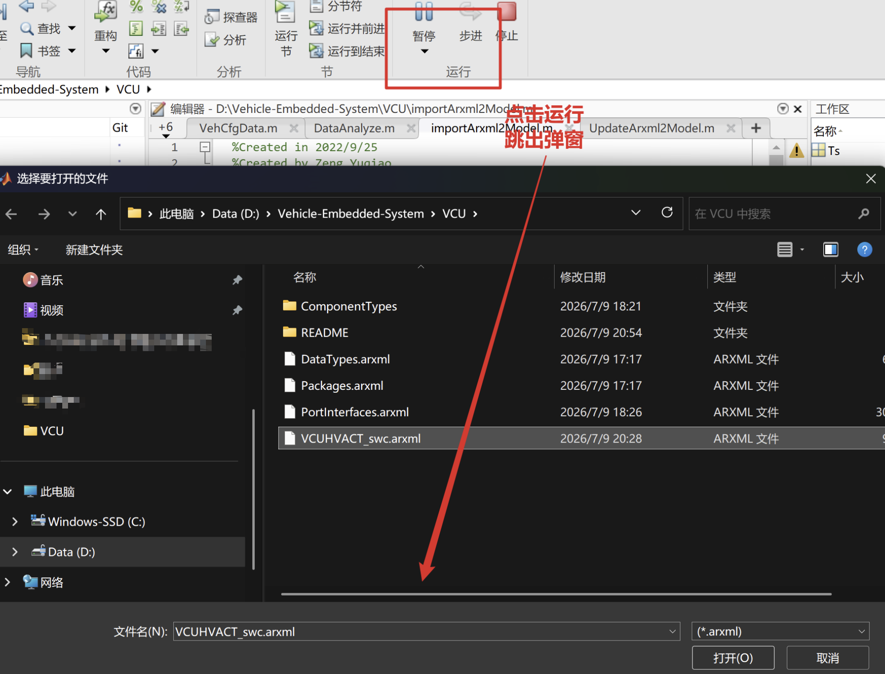

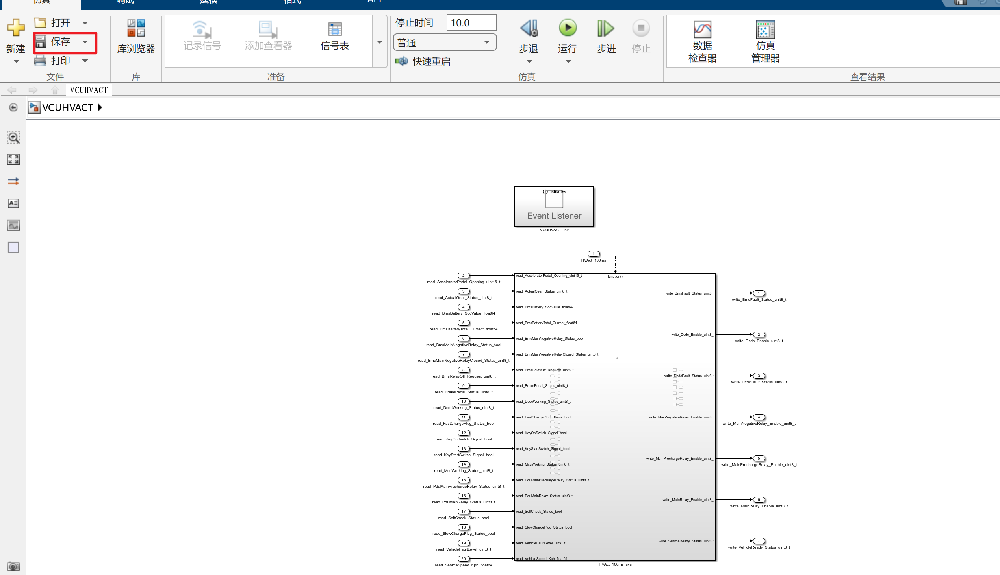

更新arxml版本：

```matlab
% 显示提示信息，表明程序正在运行
disp('.....Running.......')

% 使用 uigetfile 函数弹出文件选择对话框，让用户选择一个 Simulink 模型文件
% *.slx 和 *.mdl 是 Simulink 模型文件的扩展名
% ModelFile 变量存储用户选择的文件的完整路径和文件名
% 第二个输出参数 ~ 表示忽略该输出，这里不需要该输出
[ModelFile,~] = uigetfile('*.slx;*.mdl');

% 再次使用 uigetfile 函数弹出文件选择对话框，让用户选择一个 ARXML 文件
% ARXML 是 AUTOSAR（Automotive Open System Architecture）相关的 XML 文件格式
% ArxmlFile 变量存储用户选择的 ARXML 文件的完整路径和文件名
% 同样，第二个输出参数 ~ 表示忽略该输出
[ArxmlFile,~] = uigetfile('*.arxml');

% 检查用户是否成功选择了 Simulink 模型文件和 ARXML 文件
% isequal(ModelFile,0) 用于判断用户是否取消了模型文件的选择
% isequal(ArxmlFile,0) 用于判断用户是否取消了 ARXML 文件的选择
% 只有当两个文件都被成功选择时，才执行后续的操作
if ~isequal(ModelFile,0)&&~isequal(ArxmlFile,0)
    % 打开用户选择的 Simulink 模型文件
    open_system(ModelFile)
    
    % 创建一个 arxml.importer 对象，用于导入 ARXML 文件中的数据
    % ar 是该对象的实例，通过传入 ARXML 文件的路径进行初始化
    ar = arxml.importer(ArxmlFile);
    
    % 调用 updateModel 函数，将 ARXML 文件中的数据更新到打开的 Simulink 模型中
    % ar 是 arxml.importer 对象，ModelFile 是 Simulink 模型文件的路径
    updateModel(ar,ModelFile)
end

% 显示提示信息，表明 ARXML 文件更新到模型的操作已完成
disp('.......Update Arxml Done......')
```

**选择一个已有的 Simulink 模型，再选择一个 ARXML 文件，然后用 ARXML 更新这个模型的 AUTOSAR 接口/配置。**

也就是说，它不是从 ARXML 新建模型，而是： **已有模型 + 新 ARXML → 更新模型接口。**

## 四、VCU高压系统应用层软件设计

**stateflow的条件不能带分号**

### 4.1 软件需求

#### 4.1.1 电动汽车VCU 行车就绪档后CAN通信软件需求

当VCU检测到行车就绪档信号时，应立即启动CAN通信，允许各个ECU之间进行数据传输；当VCU未检测到行车就绪档信号时，CAN通信应处于关闭状态，以降低功耗并避免不必要的干扰。

行车就绪档：车辆钥匙处于ON位置，为车辆部分系统供电并激活相关功能

1. **行车就绪档检测**

- **信号输入**：read_KeyOnSwitch_Signal，输入行车就绪档信号

2. **CAN通信启动**

- **启动条件**：当VCU检测到有效的行车就绪档信号后，启动CAN通信信号ECAN报文发送使能(write_PCANTransmission_Enable)和PCAN报文发送使能(write_ECANTransmission_Enable)。

3. **CAN通信关闭**

- **关闭条件**：当VCU检测到行车就绪档信号read_KeyOnSwitch_Signal无效后，关闭CAN通信。

- **清理操作**：CAN通信信号ECAN报文发送使能(write_PCANTransmission_Enable)和PCAN报文发送使能(write_ECANTransmission_Enable)信号不为1.

  

- **PCAN (Powertrain CAN - 动力总成CAN)**: 这是指连接并管理**动力总成系统**的高速CAN总线。
  - **功能**：负责传递与发动机、变速箱等核心动力部件相关的关键控制信号。
  - **连接设备**：发动机控制单元（EMS）、变速箱控制单元（TCU）、自适应巡航（ACC）、自动泊车（APA）、安全气囊（SRS）等。
  - **协议**：常遵循**SAE J1939**协议。
- **ECAN (Chassis CAN - 底盘CAN)**: 这是指连接并管理**底盘和安全系统**的高速CAN总线。
  - **功能**：协调与车辆行驶稳定性和安全性相关的系统，确保行车安全。
  - **连接设备**：防抱死制动系统（ABS）、电子稳定程序（ESP）、电动助力转向系统（EPS）等。
  - **速率**：通常为**500 kbit/s**。

**实现需求：**

1. 添加一个Chart，利用stateflow撰写逻辑。

2. 添加输入输出。

   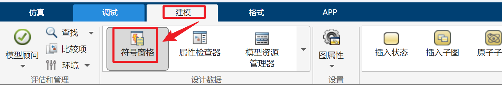

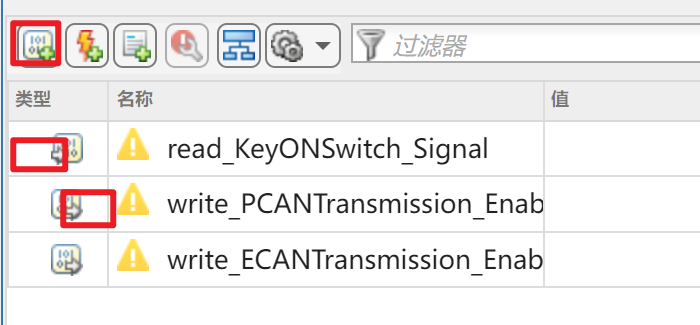

3. 利用Stateflow搭建控制逻辑：

   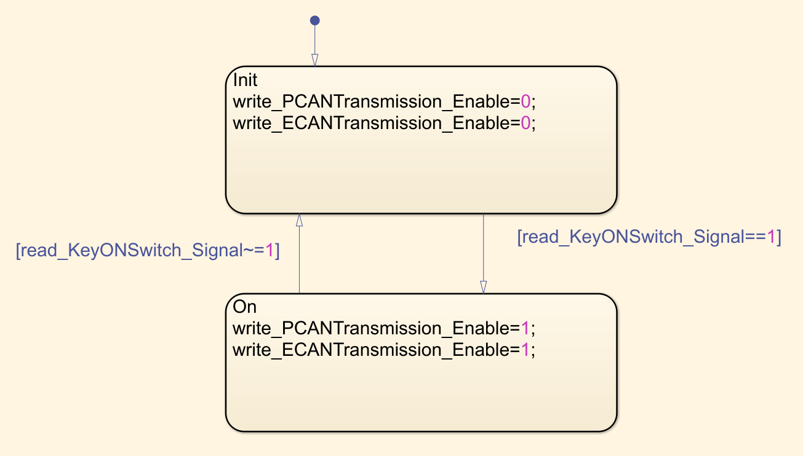

4. 为了满足后续逻辑判断的需求，这里建议是两个Enable信号变成Boolean数据类型，0写成false，1写成true。

   

#### 4.1.2 基于安全与可靠性的 VCU 自检软件需求

当 VCU、BMS 等控制器被唤醒后，VCU 需立即**启动自检**流程。在自检过程中，对检测到的故障进行评估，**判断是否影响上高压操作。若存在影响上高压的故障，VCU 将禁止上高压**；若自检无故障，则进入上电流程。同时，根据 BMS 的相关状态信息（BMS的SOC、故障等级、下电请求）进行特定的状态设置。

1. **判断条件**

- **BMS的SOC 条件**：当 BMS 所监测的电池SOC值（read_BmsBattery_SocValue）大于等于10 时，满足该条件。
- **故障等级条件**：当 BMS 的故障等级read_VehicleFaultLevel小于等于 3 时，满足该条件。
- **下电请求条件**：当 BMS 没有发出下电请求时（read_BmsRelayOff_Request==0），满足该条件。:

2. **状态设置**

- **设置规则**：当上述**三个条件同时满足**时，将特定的状态标志置为 1。该状态标志可用于后续的控制逻辑判断，如允许某些功能的开启或限制某些操作的执行。

**自检状态的debounce等待：**

当机械开关（如按钮）闭合或断开时，由于物理接触的不稳定性，信号可能会在短时间内（通常为几毫秒到几十毫秒）反复跳变，而不是立即稳定在高或低电平。这种现象称为**抖动（Bounce）。**

**Debounce 通过延时确认机制过滤掉信号的短暂波动：**

- 当检测到信号状态变化时，不立即确认，而是等待一段时间（去抖时间）。
- 如果在这段时间内信号保持稳定，则认为状态有效；否则忽略此次变化。

**实现Debounce：**

1. **基于定时器的 Debounce**

这是最常见的方法，使用一个定时器记录信号稳定的时间：

- 当信号发生变化时，启动定时器。
- 如果定时器达到预设的去抖时间且信号未再次变化，则确认状态有效。
- 如果在定时器计时期间信号再次变化，则重置定时器并重新开始计时。

2. **状态机实现**

使用状态机可以更清晰地管理 Debounce 的逻辑：

- 状态 1：等待信号变化。
- 状态 2：检测到变化，启动定时器并进入计时状态。
- 状态 3：定时器超时，确认状态有效并更新输出。

**需求实现：**

1. 对三个**启动自检判断条件**进行处理，然后和CAN通信启动条件融合考虑，即自检无误，且处在行车就绪档才往后进行上电。

   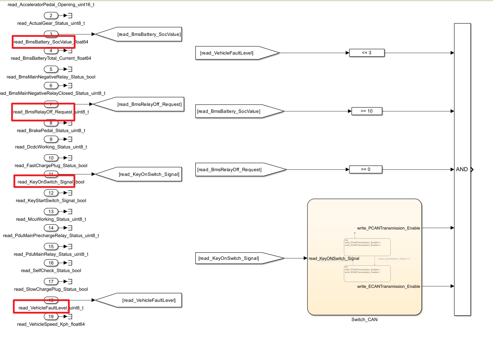

   2. 构建Debounce等待的逻辑。

      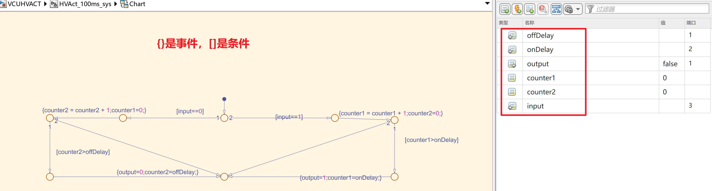

​		这里的counter1和counter2有初始值0，output**初始值写的0**

​		逻辑：

```c
if input == 0
    counter2 = counter2 + 1;
    counter1 = 0;

    if counter2 > offDelay
        output = 0;
        counter2 = offDelay;
    end

elseif input == 1
    counter1 = counter1 + 1;
    counter2 = 0;

    if counter1 > onDelay
        output = 1;
        counter1 = onDelay;
    end
end
```

它接收一个原始输入信号 `input`，不会因为 `input` 瞬间变化就立刻改变输出，而是要求这个输入连续稳定一段时间后，才更新 `output`。

当 `input` 等于 `0` 时，认为当前信号正在请求关闭。此时低电平计数器 `counter2` 每个周期加 1，同时把高电平计数器 `counter1` 清零。如果 `input` 连续为 `0` 的时间超过 `offDelay`，就把 `output` 置为 `0`，并把 `counter2` 限制在 `offDelay`，防止它继续无限增大。

当 `input` 等于 `1` 时，认为当前信号正在请求开启。此时高电平计数器 `counter1` 每个周期加 1，同时把低电平计数器 `counter2` 清零。如果 `input` 连续为 `1` 的时间超过 `onDelay`，就把 `output` 置为 `1`，并把 `counter1` 限制在 `onDelay`，防止它继续无限增大。

所以它的作用就是：过滤短暂抖动。只有 `input` 连续为 `1` 超过 `onDelay` 后，输出才变成 `1`；只有 `input` 连续为 `0` 超过 `offDelay` 后，输出才变成 `0`。在你的模型里 `onDelay=5`、`offDelay=5`，并且判断条件是 `>`，所以需要**连续 6 个采样周期才会真正翻转输出。**

**不断采样，不断更新，根据采样的循环，不需要在stateflow里面写循环语句！**

#### 4.1.3 行车就绪档上电控制流程软件需求

```text
Init 初始状态
    ↓ SelfCheck==1 且 Counter>=30
HV_On 上电流程
    ↓ 上电完成
HV_Standy 高压保持状态
    ↓ SelfCheck!=1
HV_OFF 下电等待
    ↓ Counter>=30
HV_OFFStandy 下电流程
    ↓ 下电完成/异常
Init
```


这一部分，就是正式执行上电的逻辑了，当车辆自检无影响上高压故障时，VCU 负责控制上电流程，**依次**发送**主负接触器闭合指令和 DCDC 闭合指令。**BMS 和 DCDC 需在规定时间内响应并完成相应操作，软件需**对响应情况进行监控和处理**，确保车辆能够进入 行车就绪档高压状态或在出现故障时采取适当的措施。

进入状态机后初始化状态如下：

| 物理含义           | 变量名                         | 初始状态 |
| ------------------ | ------------------------------ | -------- |
| VCU休眠状态        | write_VcuSleep_Status          | 唤醒     |
| DCDC使能           | write_Dcdc_Enable              | 不使能   |
| 主负接触器控制指令 | write_MainNegativeRelay_Enable | 不使能   |

**自检结果判断**

- 输入：自检结果信息置1且debounce 3s时间后初始化。

- 处理逻辑：软件应实时监测自检结果，当检测到自检无影响上高压故障时，如下信号进行初始化

| 物理含义           | 变量名                         | 初始状态 |
| ------------------ | ------------------------------ | -------- |
| DCDC使能           | write_Dcdc_Enable              | 不使能   |
| 主负接触器控制指令 | write_MainNegativeRelay_Enable | 使能     |

**主负接触器闭合控制**

主负接触器先闭合，然后需要等待VCU发送 给BMS 主负接触器闭合指令（read_BmsMainNegativeRelayClosed_Status==1）。

​	**1. 指令发送**

​	时间要求：自检无影响上高压故障确认后，VCU 应在 3s内发送主负接触器闭合指令。

​	**2. 成功发送BMS 主负接触器闭合指令**

​	成功发送后等待**DCDC闭合指令**

​	**2. 未成功发送操作**

​	进入下电状态

**DCDC 闭合控制**

 	**1. DCDC主动闭合**

​	成功发送BMS 主负接触器闭合指令后，debounce时间3s

​	然后DCDC使能，信号指令如下

| 信号              | 状态 |
| ----------------- | ---- |
| write_Dcdc_Enable | ==1  |

**完成需求：**

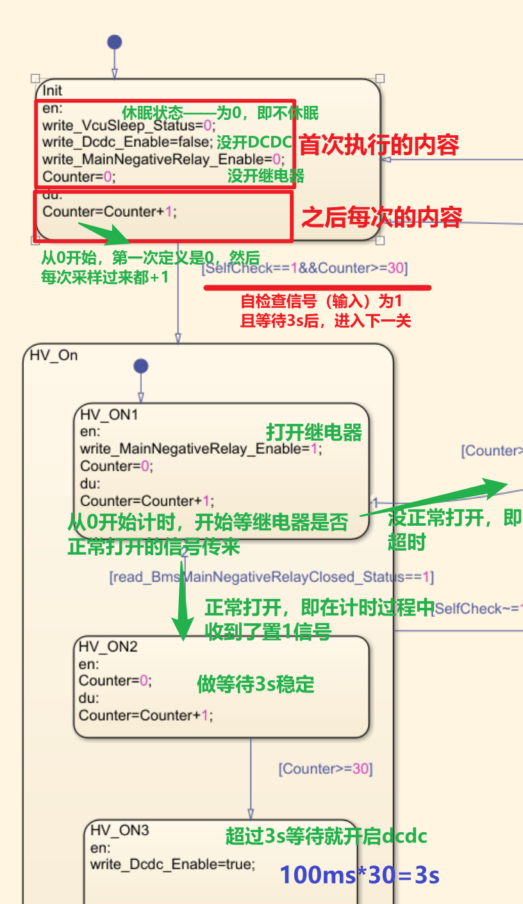

#### 4.1.4 故障诊断逻辑

在整个过程中，会对可能出现的异常情况进行处理，如 DCDC 未反馈停机状态、BMS 主负接触器断开超时等，并防止因钥匙快速上下电导致的频繁停。

**HV高压状态state构建**

构建一个HV高压状态的state

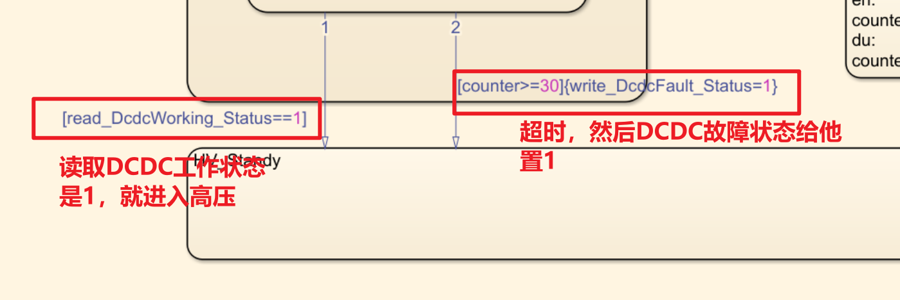

**1：自检错误 等待下电状态**

1. **状态触发**

- **输入**：车辆处于高压状态，但自检状态不等于1。
- **处理逻辑**：软件应立即启动一个 3s 的定时器开始计时。
- **信号**

| 信号      | 物理含义 |
| --------- | -------- |
| SelfCheck | 自检     |
| Counter   | 计时器   |

2. **等待操作**

   1. 3s内自检状态为1

   - **状态**：VCU继续返回车辆高压状态

   2. 3s后自检状态依旧不为1

   - **状态**：VCU进入新建的chart模块**下电状态**。

3. **完成建模**

   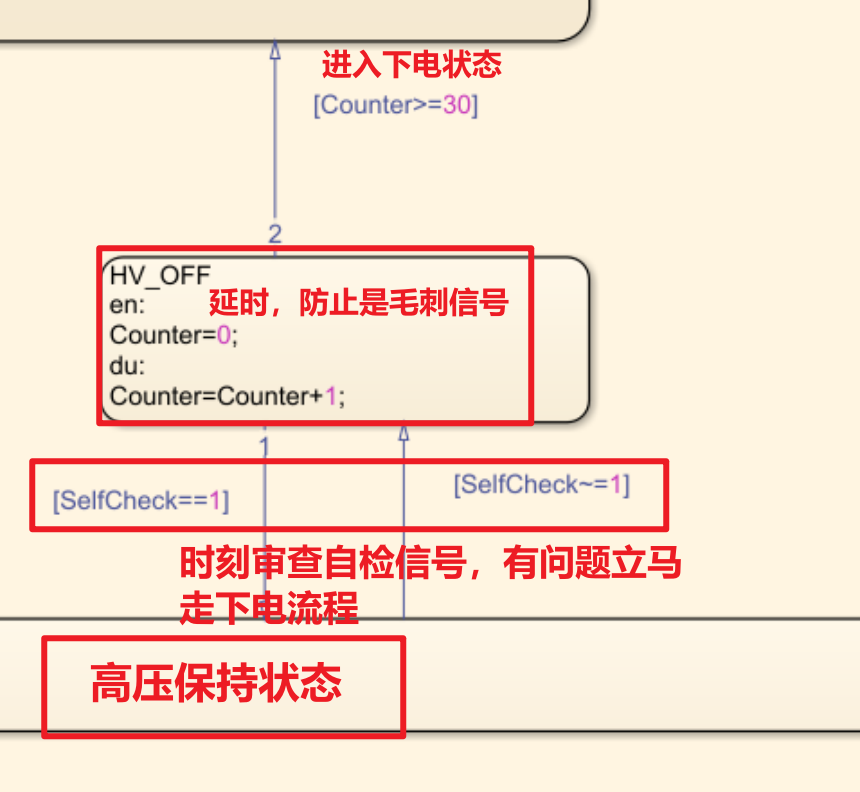

   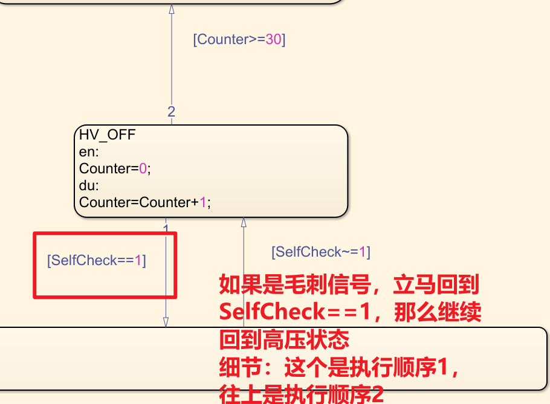

​	

**2：停止DC/DC使能**

进入下电状态指令后，立马让DCDC使能信号置0，并进行计时

**信号**

| 物理含义 | 信号名字          | 状态 |
| -------- | ----------------- | ---- |
| DCDC使能 | write_Dcdc_Enable | =0   |
| 计数器   | Counter           | 计数 |

**转移**

如果计时大于3s或者电池SOC值(read_BmsBattery_SocValue)小于10,进入下一状态

**3：主负接触器断开**

主负接触器控制指令（write_MainNegativeRelay_Enable）自动断开

**1:3s内接收到BMS下高压请求**

如果**3s内接收到BMS下高压请求**（read_BmsRelayOff_Request==1），则正常返回初始化状态

**2:3s内未接收到BMS下高压请求**

如果**3s以后未接收到BMS下高压请求**（read_BmsRelayOff_Request~=1），也返回初始化状态，但对BMS故障状态置1，报出BMS故障（write_BmsFault_Status=1）

**完成建模**

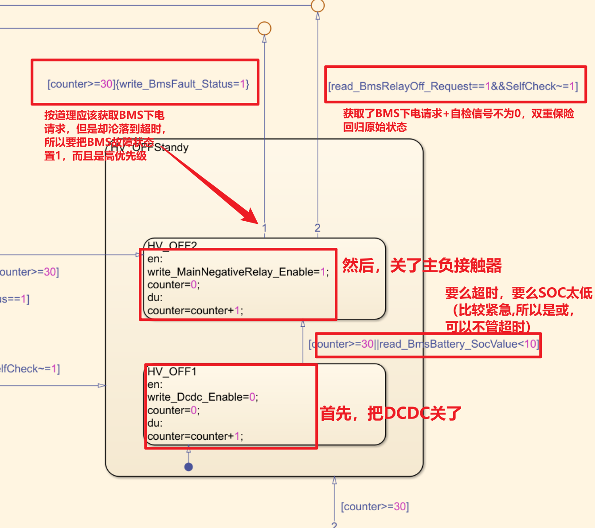

**4：主负接触器上电失败**

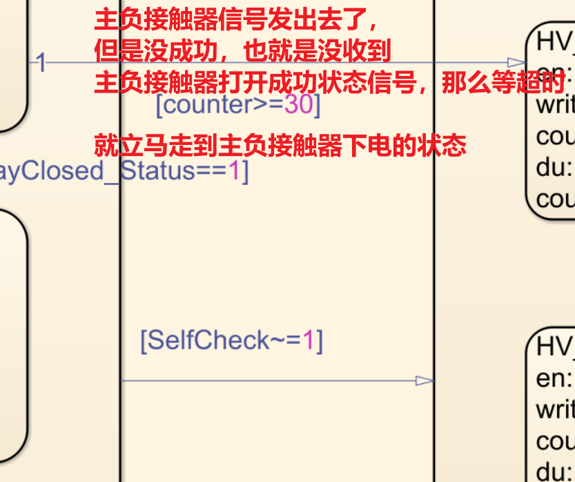

**5：上电过程中，突然自检信号不为1**

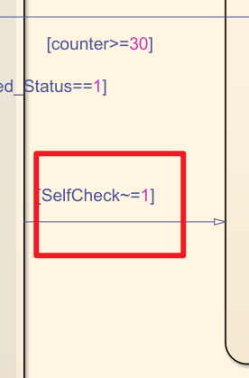

#### 4.1.5 动力激活档上电控制策略需求

就是前面是完成了主负接触器和DCDC控制，这里需要完成主正接触器，主预充接触器控制。

1. **高压母线连接需求**：电机控制器直流高压母线需连接在整车高压母线上，确保高压电能的传输。
2. **主预充接触器功能需求**：在接通主正接触器之前，主预充接触器应先闭合，使主正接触器两端电压达到与母线电压一致，防止反向电压冲击电机控制器及瞬间电流过大冲击，其回路需带有电阻及二极管。
3. **接触器动作顺序需求**：主预充接触器闭合后，当主正接触器两端电压与母线电压一致时，闭合主正接触器，随后断开主预充接触器。


1. **动力激活档上高压前置条件需求1**

   1. 车辆必须已完成行车就绪挡上高压，标志是：DCDC已经使能(write_Dcdc_Enable)。
   2. 车辆处于未连接充电枪状态，即快充(read_FastChargePlug_Status)及慢充（read_SlowChargePlug_Status）充电连接信号均为0。

2. **动力激活档上高压前置条件需求2**

   1. 加速踏板开度值信号无效。（read_AcceleratorPedal_Opening）
   2. 制动信号有效。（read_BrakePedal_Status）
   3. 档位为空挡。（read_ActualGear_Status）
   4. 车辆静止状态（车速小于3km/h）。（read_VehicleSpeed_Kph）
   5. 动力激活档信号有效。（read_KeyStartSwitch_Signal=1）

   ### 动力激活档上高压条件需求解读表

   | 序号 | 条件原文（信号）             | 信号名称                         | 条件含义                                                     | 核心安全目的                                                 |
   | :--- | :--------------------------- | :------------------------------- | :----------------------------------------------------------- | :----------------------------------------------------------- |
   | 1    | 加速踏板开度值信号无效       | `read_AcceleratorPedal_Opening`  | 系统确认加速踏板未被踩下，且踏板位置传感器信号无故障（有效值为0或无效状态）。 | **防止启动时意外加速**：确保高压上电瞬间动力系统无扭矩输出请求，**杜绝车辆突然前冲。** |
   | 2    | 制动信号有效                 | `read_BrakePedal_Status`         | 系统检测到制动踏板已被驾驶员踩下（通常为有效高电平或开关信号）。 | **强制驾驶员参与**：要求驾驶员**主动踩刹车，表明其处于控制状态**，是启动的标准安全操作。 |
   | 3    | 档位为空挡                   | `read_ActualGear_Status`         | 变速箱实际处于N挡（空挡），而非D、R或P挡（部分系统允许P挡，但此逻辑严格限定N挡）。 | **切断动力传递路径**：**即使电机启动，动力也不会传到车轮，从机械上杜绝车辆移动。** |
   | 4    | 车辆静止状态（车速＜3 km/h） | `read_VehicleSpeed_Kph`          | 车速实测值小于3 km/h，视为完全静止。                         | **防止行驶中误上电**：避免在滑行或低速行驶时接通高压，对传动系统和高压部件造成冲击损伤。 |
   | 5    | 动力激活档信号有效           | `read_KeyStartSwitch_Signal = 1` | 驾驶员发出了**明确的启动指令（如一键启动按钮按下或钥匙拧至START位置）**。 | **触发整个流程**：作为上电流程的“总开关”，代表驾驶员的主动启动意图，激活安全检测逻辑。 |

   ------

   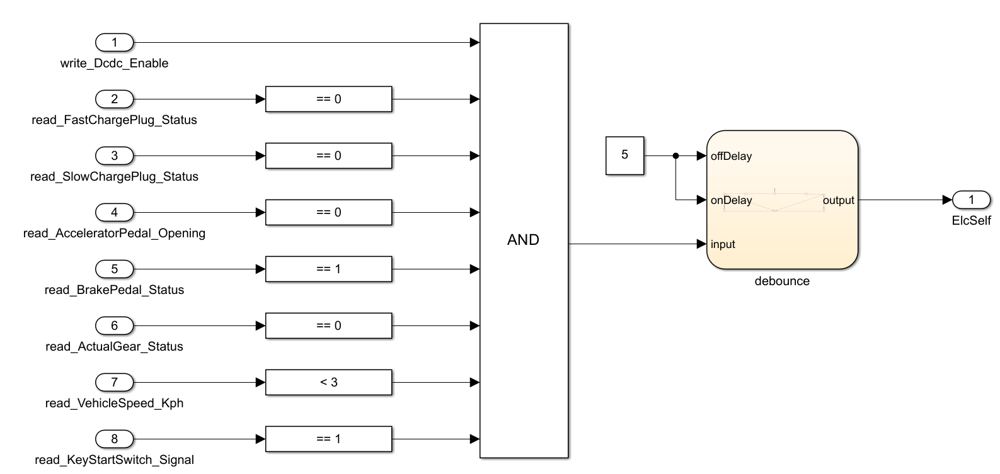

3. **动力激活档上高压流程需求**

   1. 主动放电为0（write_McuActiveDischarge_Instruction=0）——**主动放电**指在高压系统（如电动汽车）中，指在关闭或紧急情况下，通过放电电阻（主动放电电阻）快速泄放直流母线电容器中储存的高压电能的过程。

      如果上电瞬间，MCU还处在“主动放电”模式（即放电电阻还接通着），此时您命令闭合预充接触器给电容充电，相当于**一边往水池蓄水，一边开闸放水**。这会导致：

      1. **预充电阻过载烧毁**（大电流持续流过放电电阻）。
      2. **预充电压永远达不到目标值**（因为电压被放电电阻拉低），导致系统判定预充失败，触发超时下电。

   2. **主预充接触器控制需求**：完成前置条件后，主预充接触器控制指令（write_MainPrechargeRelay_Enable）先提前完成闭合，然后在3s内等待主预充接触器状态信号置1（read_PduMainPrechargeRelay_Status=1），如果**超过3s未等到，则断开主预充接触器。**

   3. **主正接触器控制需求**：VCU接收到主预充接触器闭合状态后，先闭合主正接触器（write_MainRelay_Enable），发送主正接触器闭合指令（read_PduMainRelay_Status），PDU接收到指令后控制闭合主正接触器并反馈闭合状态，若**超过3s未闭合，则进入下电流程。**

   4. **主预充接触器断开需求**：VCU接收到主正接触器闭合状态后，经过1s后主预充接触器断开（write_MainPrechargeRelay_Enable）。

   5. **Ready信号发送需求**：上高压完成，电驱动高压供电接通，车辆具备行车条件时，主预接触器断开后延时1s，VCU发送Ready信号（write_VehicleReady_Status ），仪表显示Ready状态。

   6. **上电过程中出现前置条件检查出现~=1,也及时下电。**

      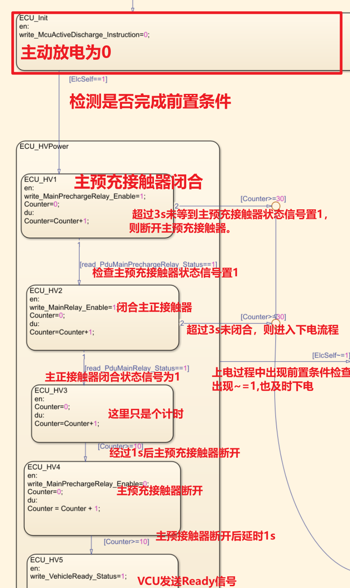

4. **不满足动力激活档上高压前置条件下高压流程需求**

   1. **Ready信号处理需求**：车辆处于Ready状态时，若检测到行车就绪档挡信号丢失、充电插枪信号有效、整车故障等级大于等于3等情况，停止发送Ready信号。

   2. **接触器控制需求**：发送主正接触器断开指令，主预充接触器指令保持断开状态，PDU接收到主正接触器断开指令后控制断开主正接触器。

   3. **主动放电需求**：VCU检测到主正接触器及主预充接触器处于断开状态后，发送主动放电指令（read_McuWorking_Status=2），MCU接收到指令后进行主动放电（write_McuActiveDischarge_Instruction=1），MCU母线电压快速下降至安全电压下，主动放电完成后反馈主动放电完成状态；若超过2s未接收到主动放电完成状态，进入行车就绪挡上高压状态。

      | 状态值（示例） | 状态名称                            | 含义解读                                                     |
      | :------------- | :---------------------------------- | :----------------------------------------------------------- |
      | 0x00           | **待机/空闲 (Standby)**             | MCU高压母线已上电完成，驱动IGBT未开放，无扭矩输出，准备就绪。 |
      | 0x01           | **运行/使能 (Running)**             | MCU处于驱动模式，正在输出三相交流电驱动电机（行车状态）。    |
      | 0x02           | **主动放电中 (Active Discharging)** | MCU内部正在执行主动放电（接通放电电阻泄放母线电容电压）。    |
      | 0x03           | **故障 (Fault)**                    | MCU检测到内部过流、过温、IGBT短路等严重故障，进入安全保护态。 |
      | 0x04           | **下电/休眠 (Sleep)**               | 高压已完全切断，MCU处于低压待机休眠状态。                    |

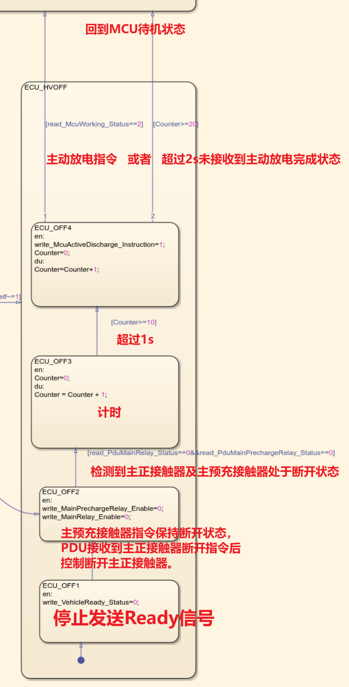

下电的故障信号没有处理！后续重点

## 五、软件逻辑构建&&模型规范性检查

### 5.1 **整理框架**

输入量→逻辑判断→输出量

Bus模块与Goto模块构建逻辑输入量，如下图

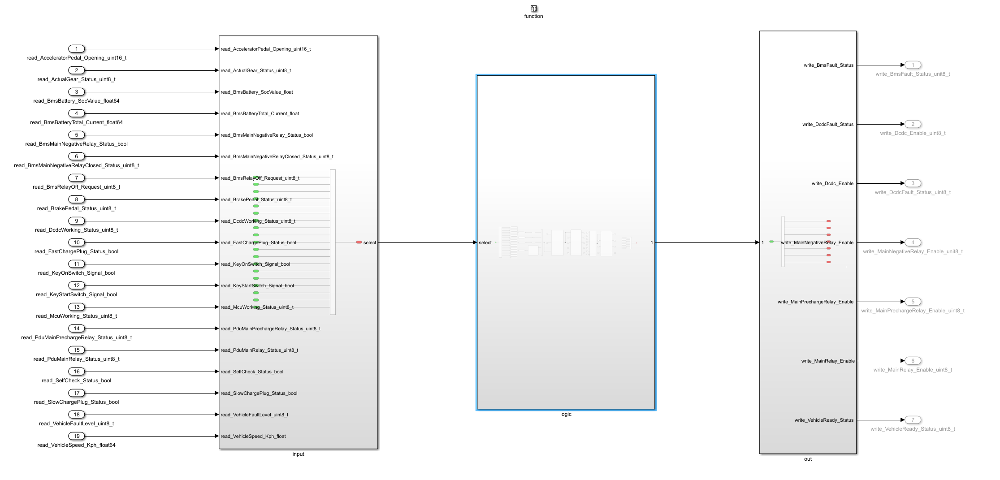

不同模块不同颜色：

- **输入端口（Inport）** → 绿色
- **输出端口（Outport）** → 红色
- **常量模块（Constant）** → 橙色
- **增益模块（Gain）** → 青色
- **Goto模块** → 浅蓝色
- **From模块** → 浅蓝色

可使用matlab脚本实现：
```matlab
%% Inport block use Green
function UpdateBlockColor
    temp = find_system(bdroot,'BlockType','Inport');
    for i = 1 : length(temp)
    set_param(temp{i},'BackgroundColor','Green')
    end
    %% Outport block use Red
    temp = find_system(bdroot,'BlockType','Outport');
    for i = 1 : length(temp)
    set_param(temp{i},'BackgroundColor','Red')
    end
    clear temp;
    %% Constant block use Orange
    temp = find_system(bdroot,'FindAll','On','BlockType','Constant');
    for i = 1 : length(temp)
        pname = get_param(temp(i),'value');
        set_param(temp(i),'BackgroundColor','Orange');
    end
    clear temp;
    %% Gain block use Cyan
    temp = find_system(bdroot,'FindAll','On','BlockType','Gain');
    for i = 1 : length(temp)
        set_param(temp(i),'BackgroundColor','Cyan');
    end
   %% Goto block use Cyan
    temp = find_system(bdroot,'FindAll','On','BlockType','Goto');
    for i = 1 : length(temp)
        set_param(temp(i),'BackgroundColor','LightBlue');
    end
    %% From block use Cyan
    temp = find_system(bdroot,'FindAll','On','BlockType','From');
    for i = 1 : length(temp)
        set_param(temp(i),'BackgroundColor','LightBlue');
    end
end
```

### 5.2 利用Model Advisor做模型规范性检查

需要检查的：

1. 按产品选择以下：

   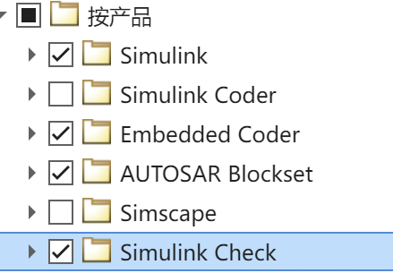

2. 按任务选择以下：

   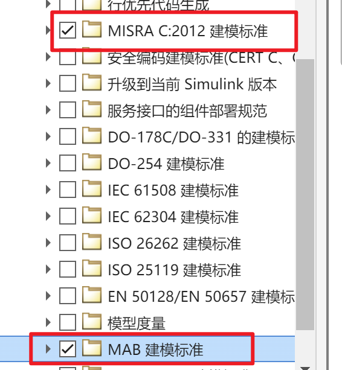

还有ISO26262—忘记标注了

## 六、Model测试

在基于模型的设计 (Model-Based Design) 流程中，**Simulink 单独测试**和 MIL 测试是两个重要的验证阶段，它们的主要区别如下：

1. 测试定义与范围

- Simulink **单元测试**
  - 对模型中的某个模块或**子系统进行孤立测试**
  - 关注模块内部逻辑的正确性
  - 通常由开发人员在模型构建阶段执行
- MIL (Model-in-the-Loop) 测试
  - 对**完整模型或系统级模型进行测试**
  - 验证模型整体功能与需求的一致性
  - 属于集成测试阶段，通常在系统集成环境中执行

2. 测试环境

- Simulink 单独测试
  - 使用简化的测试环境，可能包含测试激励源和结果验证模块
  - 不考虑与外部系统的交互
- MIL 测试
  - 需要构建接近真实系统的测试环境
  - 可能包含输入信号模拟器、输出结果比较器等组件
  - 可能需要与需求管理工具集成以验证需求覆盖率

3. 测试目标

- Simulink 单独测试
  - 验证模块的功能逻辑是否正确
  - 检查边界条件和异常情况处理
  - 发现模块内部的设计错误
- MIL 测试
  - 验证整个模型是否满足系统需求
  - 检查模块间的交互和数据流是否正确
  - 评估系统级性能指标

### 6.1 单元测试

1. 首先需要确认模型编译没有错误。

#### 6.1.1 模块一：自检模块

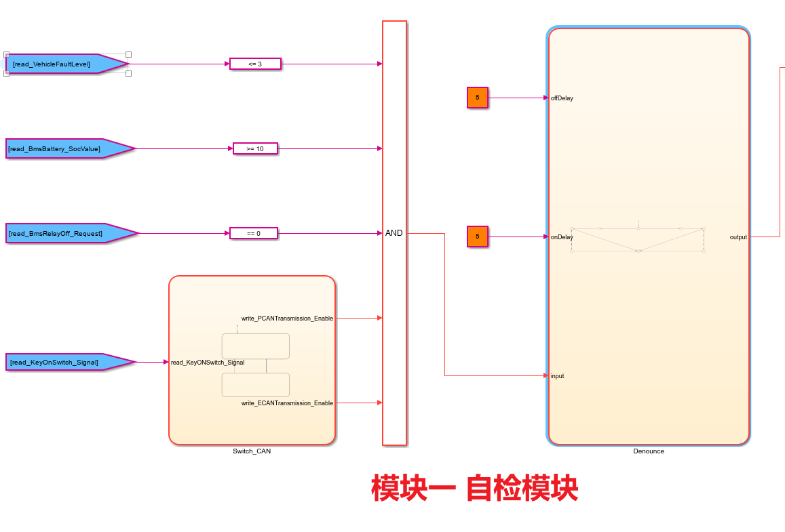

| 信号名                                                       | 信号值 |
| ------------------------------------------------------------ | ------ |
| read_VehicleFaultLevel_uint8_t（车故障等级<=3就可以）        | 1      |
| read_BmsBattery_SocValue_float（SOC>=10即可）                | 20     |
| read_BmsRelayOff_Request_uint8_t（BMS 没有发出下电请求时（read_BmsRelayOff_Request==0）） | 0      |
| read_KeyOnSwitch_Signal_bool（行车就绪档信号，打开CAN通信）  | 1      |

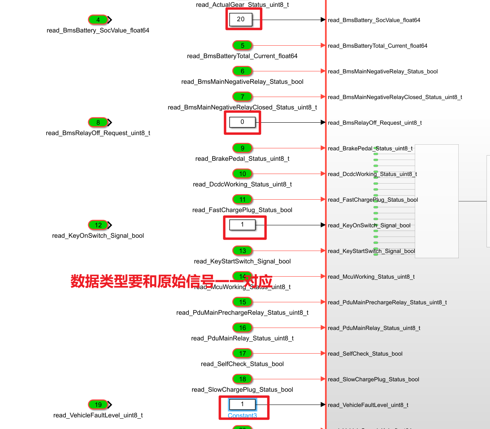

第一次测试发现：

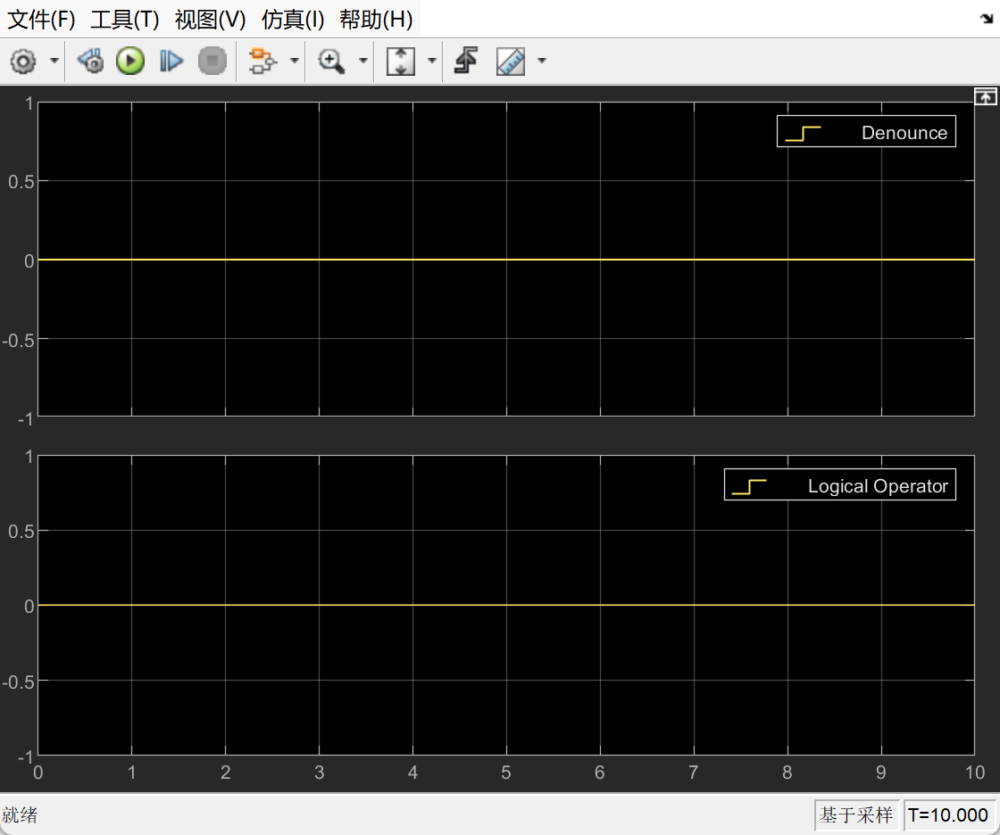

从stateflow中一步步步进去看：

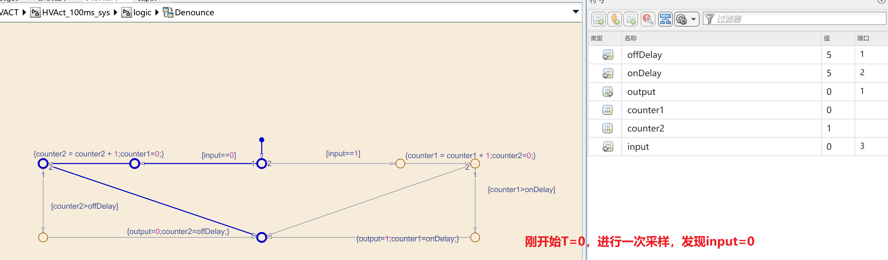

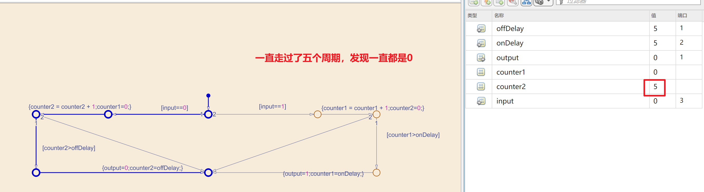

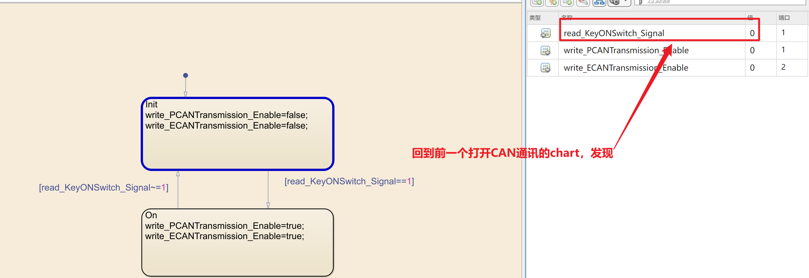

最后发现是没接上线！

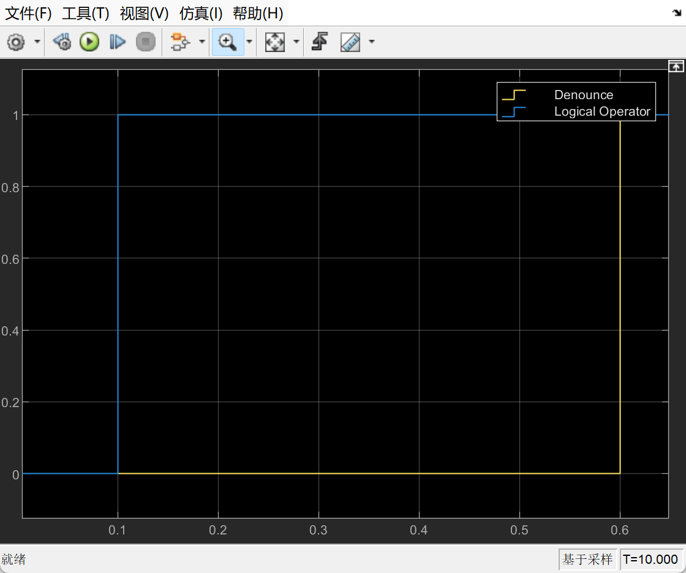

#### 6.1.2 模块二：启动DCDC模块

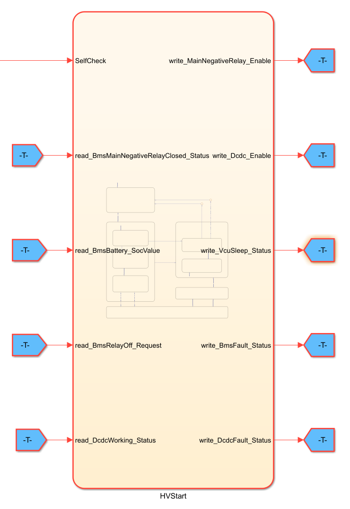

**==补充==输入信号：**

| 信号名                                         | 信号值 |
| ---------------------------------------------- | ------ |
| read_BmsMainNegativeRelayClosed_Status_uint8_t | 1      |
| read_BmsRelayOff_Request_uint8_t               | 0      |
| read_DcdcWorking_Status_uint8_t                | 1      |

**输出信号**

| 信号名                         | 信号值 |
| ------------------------------ | ------ |
| write_VcuSleep_Status          | 0      |
| write_MainNegativeRelay_Enable | 1      |
| write_Dcdc_Enable              | 1      |
| write_BmsFault_Status          | 0      |
| write_DcdcFault_Status         | 0      |

正常图像：

VcuSleep一直都是0

MainNegativeRelay从0过3s先到1

DCDC_Enable是从0等上面MainNegative到1过3s到1

BmsFault_Status和DcdcFault_Status一直是0

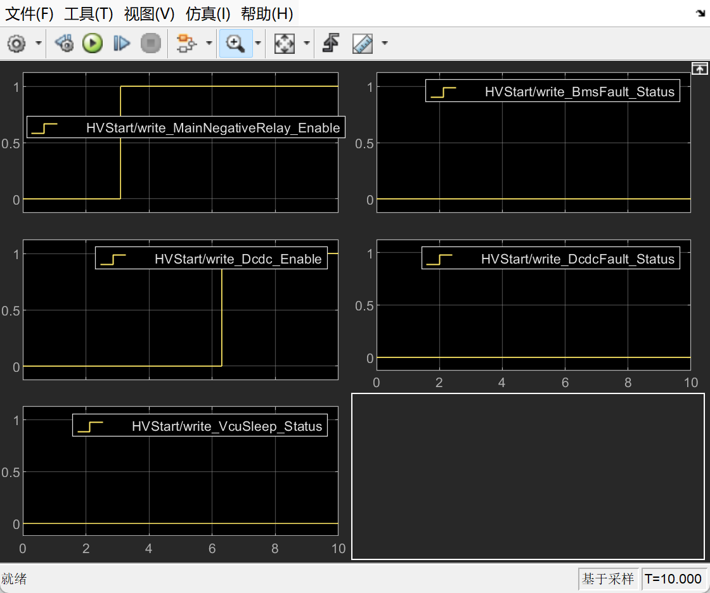

#### 6.1.3 模块三：动力激活档上高压前置自检模块

**==补充==输入信号**

| 信号名                        | 信号值 |
| ----------------------------- | ------ |
| read_FastChargePlug_Status    | 0      |
| read_SlowChargePlug_Status    | 0      |
| read_AcceleratorPedal_Opening | 0      |
| read_BrakePedal_Status        | 1      |
| read_ActualGear_Status        | 0      |
| read_VehicleSpeed_Kph         | 2      |
| read_KeyStartSwitch_Signal    | 1      |

**输出信号**

| 信号名  | 信号值 |
| ------- | ------ |
| ElcSelf | 1      |

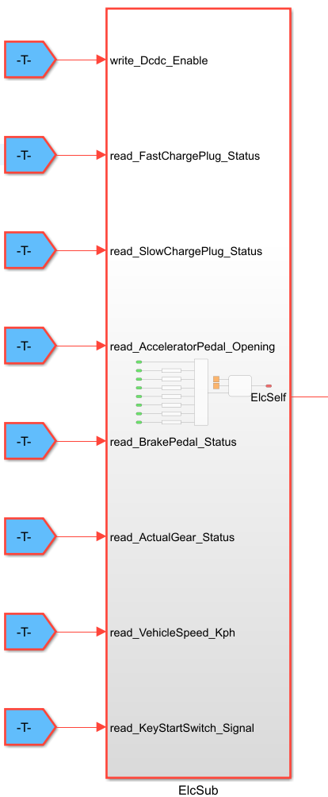

正常输出应该是：

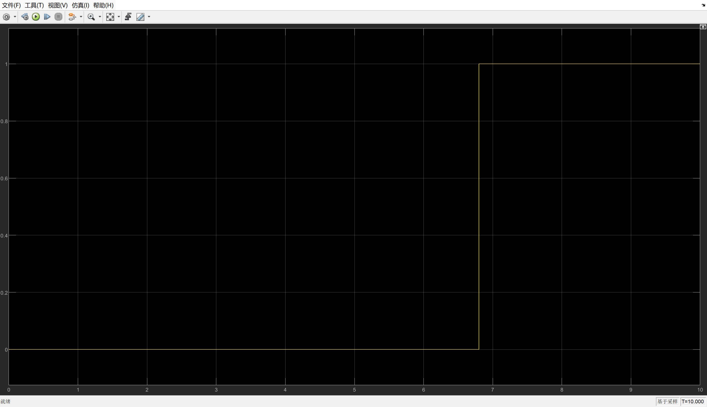

为什么状态切换时间不是整数？可能原因：

1.如果测试输入已经把主负继电器闭合反馈设为 1，状态机仍然要等到下一个 100 ms 调度点才能读取反馈并迁移，因此这里通常增加约：

\[ 0.1\text{ s} \]

所以到达 `HV_ON2` 大约在：

\[ 3.0/3.1+0.1\approx3.1/3.2\text{ s} \]

2. 模型的 Runnable 是 `HVAct_100ms`，即每 0.1 s 执行一次；`debounce` 的接通延迟设为 5，因此延迟约为：

\[ 5 \times 0.1\,\text{s}=0.5\,\text{s} \]

所以，如果全部原始条件在约 6.3 s 首次同时成立，那么：

\[ 6.3+0.5=6.8\,\text{s} \]

#### 6.1.4 模块四：动力激活挡上电模块

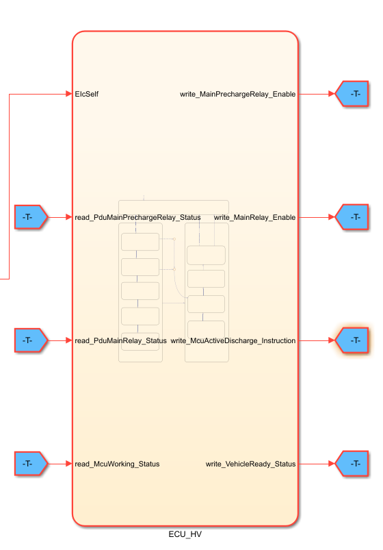

**==补充==输入信号**

| 信号名                            | 信号值 |
| --------------------------------- | ------ |
| read_McuWorking_Status            | 0      |
| read_PduMainPrechargeRelay_Status | 1      |
| read_PduMainRelay_Status          | 1      |

**输出信号**

| 信号名                               | 信号值 |
| ------------------------------------ | ------ |
| write_MainPrechargeRelay_Enable      | 0      |
| write_McuActiveDischarge_Instruction | 0      |
| write_VehicleReady_Status            | 1      |
| write_MainRelay_Enable               | 1      |

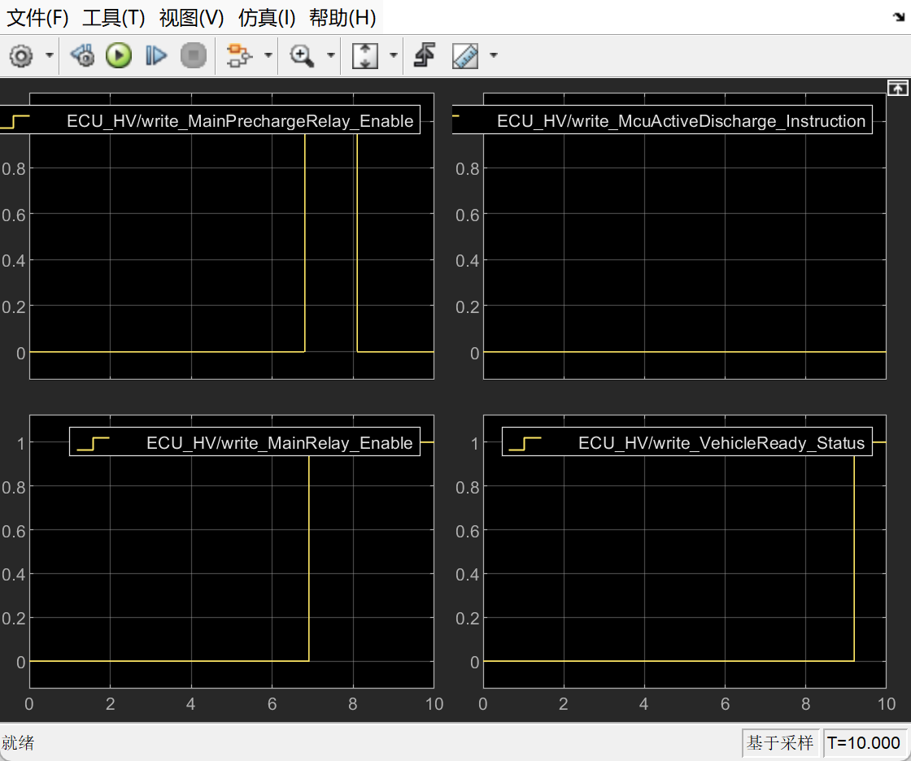

可以通过打断点的方式来一步步调试：我们以观察write_MainPrechargeRelay_Enable切换的时间节点为例：


和8.1s切换时机对得上号！！！

### 6.2 MIL测试

1. 创建测试框架

   

2. 打开测试管理器


3. 创造测试

   


先别急着下一步！！！

4. 记录所有输出信号，然后保存

   

5. 选择一个测试用例（生成一个excel表格）

   

6. 构建测试xlsx。

   | 信号名                                         | 信号值 |
   | ---------------------------------------------- | ------ |
   | read_VehicleFaultLevel_uint8_t                 | 1      |
   | read_BmsBattery_SocValue_float                 | 20     |
   | read_BmsRelayOff_Request_uint8_t               | 0      |
   | read_KeyOnSwitch_Signal_bool                   | 1      |
   | read_BmsMainNegativeRelayClosed_Status_uint8_t | 1      |
   | read_BmsRelayOff_Request_uint8_t               | 0      |
   | read_DcdcWorking_Status_uint8_t                | 1      |
   | read_FastChargePlug_Status                     | 0      |
   | read_SlowChargePlug_Status                     | 0      |
   | read_AcceleratorPedal_Opening                  | 0      |
   | read_BrakePedal_Status                         | 1      |
   | read_ActualGear_Status                         | 0      |
   | read_VehicleSpeed_Kph                          | 2      |
   | read_KeyStartSwitch_Signal                     | 1      |
   | read_McuWorking_Status                         | 0      |
   | read_PduMainPrechargeRelay_Status              | 1      |
   | read_PduMainRelay_Status                       | 1      |

| 信号名                          | 示波器图形                                                   | 时间点记录  |
| ------------------------------- | ------------------------------------------------------------ | ----------- |
| write_BmsFault_Status           |  |             |
| write_DcdcFault_Status          |  |             |
| write_Dcdc_Enable               |  | 6.3s变为1   |
| write_MainNegativeRelay_Enable  |  | 3.1s变为1   |
| write_MainPrechargeRelay_Enable |  | 6.8s到8s为1 |
| write_MainRelay_Enable          |  | 6.9s变为1   |
| write_VehicleReady_Status       |  | 9.2s变为1   |

跑完测试发现有错误：


发现是DCDC模块，去那边再看看，找问题：

很奇怪，如果是DCDC模块出现问题，后面的MainPrechargeRelay这些不可能正常，所以模块本身没问题，其实是输出的问题：


发现两者配置反了。

也可以用codex链接simulink官方MCP找错误，效率更高：


解决问题：


生成报告：**选择所有测试！！**


## 七、代码生成与代码解析

### 7.1 代码生成

1. 打开代码生成工具。

   

2. 检查代码和组件的映射是否正确。

   


| 类型               | 数据复制 | 发送控制 | 性能 | 适用场景           |
| ------------------ | -------- | -------- | ---- | ------------------ |
| ImplicitSend       | ✅        | 自动     | 中   | 连续数据流         |
| ImplicitSendByRef  | ❌        | 自动     | 高   | 大数据量           |
| ExplicitSend       | ✅        | 手动     | 中   | 精确控制发送时机   |
| End ToEndWrite     | ❌        | 自动     | 高   | 实时性要求高的系统 |
| ModeSend           | ✅        | 模式相关 | 中   | 多模式系统         |
| QueuedExplicitSend | ✅        | 手动     | 低   | 有序数据处理       |

	1. ImplicitSend（隐式发送）
	
	- 含义：数据在块执行结束时自动发送，无需显式调用发送函数。Simulink 会隐式处理数据传输。
	- 应用场景：适用于连续数据流或无需精确控制发送时机的场景。
	
	2. ImplicitSendByRef（隐式引用发送）
	
	- 含义：与 ImplicitSend 类似，但数据通过引用而非复制传递。这减少了数据复制的开销，提高了性能。
	- 应用场景：适用于大数据量或需要高效传输的场景（如数组、结构体）。
	
	3. ExplicitSend（显式发送）
	
	- 含义：数据发送需要通过显式调用发送函数（如`send`）来触发，而非自动发送。
	- 应用场景：需要精确控制数据发送时机的场景（如事件触发、条件发送）。
	
	4. End ToEndWrite（端到端写入）
	
	- 含义：数据直接写入目标位置，无需中间缓冲区。这确保数据的一致性，但可能影响性能。
	- 应用场景：适用于需要数据实时性和一致性的关键系统（如安全关键型控制）。
	
	5. ModeSend（模式发送）
	
	- 含义：数据发送与系统的运行模式相关（如正常模式、故障模式）。只有在特定模式下才会发送数据。
	- 应用场景：适用于多模式系统（如汽车的不同驾驶模式）。
	
	6. QueuedExplicitSend（队列显式发送）
	
	- 含义：显式发送的数据会被放入队列中，按顺序处理。这避免了数据竞争，但可能引入延迟。
	- 应用场景：适用于需要有序处理数据的场景（如通信协议、消息队列）。

3. 生成代码。

4. 软件和底层代码集成，先打开示例工程的developer，导入swc的arxml文件。


## 九、后续优化思路

1. ECU下电的故障信号没有处理！后续重点

2. 有些信号没用到
